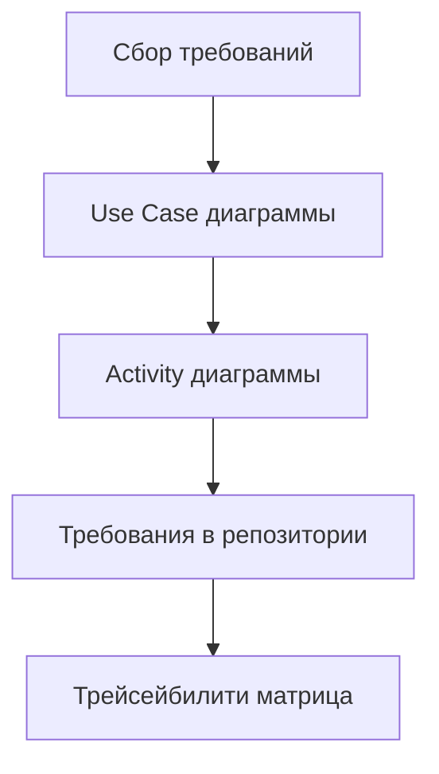
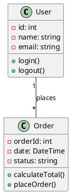
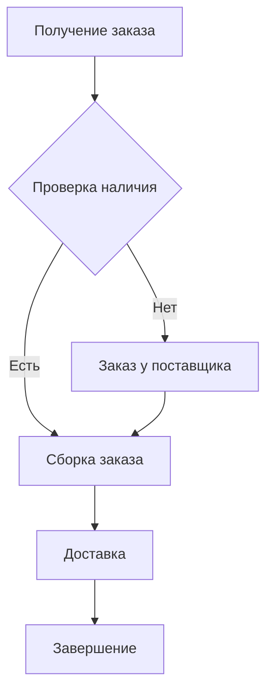
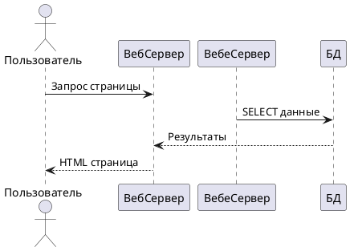
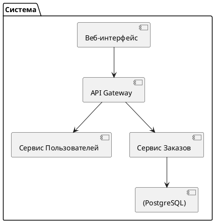

# **CASE-средства: описание, принципы работы и практика применения**

## **1. Что такое CASE-средства?**

### **Определение:**
**CASE** (Computer-Aided Software Engineering) — **компьютерные средства автоматизации разработки ПО**, которые помогают на всех этапах жизненного цикла.

### **Аналогия:**
```
CASE-средства = Цифровой конструктор для разработчиков
├── Чертежи (диаграммы)
├── Инструкции (документация)
├── Контроль качества (анализ)
└── Автоматическая сборка (генерация кода)
```

---

## **2. Классификация CASE-средств**

### **По уровням поддержки:**
```yaml
Верхнего уровня (Upper CASE):
  - Анализ требований
  - Проектирование архитектуры
  - Моделирование бизнес-процессов
  - Примеры: IBM Rational Rose, Enterprise Architect

Нижнего уровня (Lower CASE):
  - Генерация кода
  - Тестирование
  - Отладка
  - Примеры: Microsoft Visual Studio, IntelliJ IDEA

Интегрированные (Integrated CASE):
  - Полный цикл разработки
  - Примеры: IBM Engineering Workflow Management, Sparx Systems Enterprise Architect
```

### **По функциональности:**
```
1. Средства моделирования
   ├── UML-диаграммы
   ├── BPMN-процессы
   └── ER-диаграммы (базы данных)

2. Средства документирования
   ├── Генерация ТЗ
   ├── Автодокументация
   └── Отчеты

3. Средства анализа
   ├── Проверка моделей
   ├── Валидация требований
   └── Оценка сложности

4. Средства генерации
   ├── Код из моделей
   ├── SQL-скрипты
   └── Конфигурационные файлы
```

---

## **3. Основные CASE-средства на рынке**

### **Таблица сравнения популярных инструментов:**

| Инструмент | Производитель | Основная специализация | Стоимость | Платформы |
|------------|---------------|------------------------|-----------|-----------|
| **Enterprise Architect** | Sparx Systems | UML, BPMN, SysML, ArcGIS | от $299 | Windows, Cloud |
| **IBM Rational Rhapsody** | IBM | Real-time системы, embedded | от $5000 | Windows, Linux |
| **Visual Paradigm** | Visual Paradigm | UML, Agile, BPMN | от $99/мес | Кроссплатформенный |
| **MagicDraw** | Dassault Systèmes | UML, SysML, архитектурный анализ | от $2000 | Windows, Linux, Mac |
| **Lucidchart** | Lucid Software | Диаграммы онлайн, collaboration | от $7.95/мес | Веб-браузер |
| **Draw.io (diagrams.net)** | JGraph Ltd | Бесплатные диаграммы | Бесплатно | Веб, Desktop |
| **PlantUML** | Open Source | Текстовое описание диаграмм | Бесплатно | Любая платформа |

---

## **4. Принцип работы с CASE-средствами**

### **Общий workflow:**
```
Шаг 1: Создание модели
   ↓
Шаг 2: Анализ и валидация
   ↓  
Шаг 3: Генерация артефактов
   ↓
Шаг 4: Обратная разработка (реверс)
   ↓
Шаг 5: Рефакторинг и обновление
```

### **Детальный процесс:**

#### **Этап 1: Моделирование требований**


**Пример в Enterprise Architect:**
```
1. Создать новый проект
2. Добавить пакет "Требования"
3. Создать Use Case диаграмму
4. Добавить акторов и прецеденты
5. Связать с элементами требований
6. Сгенерировать отчет
```

#### **Этап 2: Проектирование архитектуры**
```yaml
Компоненты модели:
  - Классовые диаграммы (Class Diagrams)
  - Компонентные диаграммы (Component Diagrams)
  - Диаграммы развертывания (Deployment Diagrams)
  - Последовательности (Sequence Diagrams)
```

**Пример классовой диаграммы UML:**


#### **Этап 3: Генерация кода**
```
Модель → Код:
1. Настройка шаблонов генерации
2. Выбор целевого языка
3. Генерация скелета классов
4. Добавление аннотаций/атрибутов
```

**Пример генерации Java-кода из UML:**
```java
// Сгенерированный код из классовой диаграммы
public class User {
    private int id;
    private String name;
    private String email;
    
    public void login() {
        // TODO: Implement login logic
    }
    
    public void logout() {
        // TODO: Implement logout logic
    }
    
    // Геттеры и сеттеры
    public int getId() { return id; }
    public void setId(int id) { this.id = id; }
    // ...
}
```

#### **Этап 4: Обратная разработка (Reverse Engineering)**
```
Существующий код → Модель:
1. Импорт исходного кода
2. Анализ зависимостей
3. Построение диаграмм классов
4. Документирование архитектуры
```

---

## **5. Практическая работа с популярными CASE-средствами**

### **A. Sparx Systems Enterprise Architect**

#### **Основные возможности:**
```
1. Моделирование:
   ├── UML 2.5
   ├── BPMN 2.0
   ├── SysML
   ├── ArchiMate
   └── Специализированные профили

2. Управление требованиями:
   ├── Трейсейбилити
   ├── Матрицы связей
   ├── Отчеты
   └── Экспорт в Word/Excel

3. Генерация кода:
   ├── Java, C#, C++, Python, PHP
   ├── SQL DDL
   └→ Шаблоны настраиваются

4. Симуляция и исполнение:
   ├── StateMachine симуляция
   ├── BPMN исполнение
   └→ Отладка моделей
```

#### **Практический пример: Создание Use Case диаграммы**
```
1. Файл → Новый проект → Выбрать шаблон
2. В браузере проектов: Добавить → Диаграмма → UML Behavioral → Use Case
3. Панель инструментов: 
   ├── Actor (перетащить на диаграмму)
   ├── Use Case (перетащить)
   ├── Association (соединить)
4. Двойной клик на элемент → Заполнить свойства
5. Диаграмма → Сохранить как изображение
```

#### **Генерация документации:**
```
1. Выбрать элементы для документации
2. Resources → Document Generator
3. Выбрать шаблон (Standard, IEEE, Custom)
4. Настроить разделы
5. Generate → RTF/PDF/HTML
```

### **B. Visual Paradigm**

#### **Особенности:**
```yaml
Сильные стороны:
  - Интуитивный интерфейс
  - Хорошая интеграция с Agile
  - Облачная версия для команд
  - Много готовых шаблонов

Рабочий процесс:
  1. Создание storyboard
  2. Диаграммы для user stories
  3. Автоматическая генерация прототипов
  4. Экспорт в Jira/Confluence
```

#### **Пример BPMN-диаграммы процесса:**


### **C. PlantUML (текстовый подход)**

#### **Принцип работы:**
```
ТЕКСТОВЫЙ ФАЙЛ → ГЕНЕРАТОР → ДИАГРАММА

Преимущества:
- Версионный контроль диаграмм
- Легкое редактирование
- Автоматизация в CI/CD
- Бесплатно
```

#### **Примеры диаграмм:**

**Sequence Diagram:**


**Component Diagram:**


---

## **6. Интеграция CASE-средств в процесс разработки**

### **Варианты интеграции:**

#### **С Agile/Scrum:**
```yaml
Sprint Planning:
  - Моделирование user stories в CASE
  - Генерация acceptance criteria
  - Экспорт задач в Jira/Trello

Daily Development:
  - Обновление диаграмм при изменении кода
  - Визуализация прогресса
  - Общие модели для команды

Review/Retrospective:
  - Демонстрация моделей заказчику
  - Анализ изменений архитектуры
  - Обновление документации
```

#### **С DevOps CI/CD:**
```
Конвейер с CASE-средствами:
1. Разработчик меняет модель
2. Commit в Git репозиторий
3. CI сервер:
   ├── Проверяет корректность моделей
   ├── Генерирует документацию
   ├── Обновляет wiki
   └→ Уведомляет о проблемах
4. Автоматическое развертывание
```

### **Пример конфигурации для PlantUML в GitLab CI:**
```yaml
# .gitlab-ci.yml
stages:
  - documentation

generate_diagrams:
  stage: documentation
  image: plantuml/plantuml
  script:
    - plantuml -tsvg docs/*.puml
    - plantuml -tpng docs/*.puml
  artifacts:
    paths:
      - docs/*.svg
      - docs/*.png
```

---

## **7. Методологии моделирования в CASE-средствах**

### **A. UML (Unified Modeling Language)**
```
Типы диаграмм:
┌─────────────────────────────────────┐
│ Структурные:                        │
│ ├── Class (Классовые)               │
│ ├── Component (Компонентные)        │
│ ├── Deployment (Развертывания)      │
│ ├── Object (Объектные)              │
│ ├── Package (Пакетные)              │
│ └── Composite Structure             │
│                                     │
│ Поведенческие:                      │
│ ├── Use Case (Прецедентов)          │
│ ├── Activity (Активности)           │
│ ├── State Machine (Состояний)       │
│ ├── Sequence (Последовательностей)  │
│ ├── Communication (Коммуникации)    │
│ └── Timing (Временные)              │
└─────────────────────────────────────┘
```

### **B. BPMN (Business Process Model and Notation)**
```yaml
Элементы BPMN 2.0:
  Flow Objects:
    - Events: Start, Intermediate, End
    - Activities: Task, Sub-Process
    - Gateways: Exclusive, Parallel, Inclusive
    
  Connecting Objects:
    - Sequence Flows
    - Message Flows
    - Associations
    
  Swimlanes:
    - Pools
    - Lanes
    
  Artifacts:
    - Data Objects
    - Groups
    - Annotations
```

### **C. ER-диаграммы (Entity-Relationship)**
```
Для проектирования БД:
1. Сущности (Entities)
2. Атрибуты (Attributes)
3. Связи (Relationships)
   ├── 1:1 (One-to-One)
   ├── 1:N (One-to-Many)
   └── N:M (Many-to-Many)
```

---

## **8. Автоматизация в CASE-средствах**

### **Скрипты и макросы:**

#### **Enterprise Architect (JavaScript/VBScript):**
```javascript
// Пример скрипта для генерации отчетов
function generateDocumentation() {
    var currentDiagram = Repository.GetCurrentDiagram();
    if (currentDiagram != null) {
        var reportGenerator = Repository.CreateDocumentGenerator();
        reportGenerator.SetOption("Template", "Standard");
        reportGenerator.SetOption("Format", "PDF");
        reportGenerator.ProcessDiagram(currentDiagram.DiagramID);
        reportGenerator.SaveDocument("C:\\Docs\\report.pdf");
        Session.Output("Документация сгенерирована!");
    }
}
```

#### **PlantUML автоматизация:**
```bash
#!/bin/bash
# Скрипт для массовой генерации диаграмм
for file in *.puml; do
    plantuml -tpng "$file"
    plantuml -tsvg "$file"
done
```

### **API и интеграции:**
```python
# Пример Python скрипта для работы с Enterprise Architect API
import win32com.client

# Подключение к EA
ea = win32com.client.Dispatch("EA.App")
repository = ea.Repository

# Открытие проекта
repository.OpenFile("C:\\Projects\\model.eap")

# Получение всех диаграмм
diagrams = repository.GetDiagramList("")
for diagram in diagrams:
    print(f"Диаграмма: {diagram.Name}")
    
# Создание нового элемента
package = repository.Models.GetByName("Business Model")
new_class = package.Elements.AddNew("Customer", "Class")
new_class.Update()
```

---

## **9. Best Practices работы с CASE-средствами**

### **Организационные практики:**
```markdown
1. **Единые стандарты**
   - Соглашение по именованию
   - Стандартные шаблоны
   - Правила оформления диаграмм

2. **Контроль версий моделей**
   - Хранение в Git/SVN
   - Коммиты с описаниями
   - Code review для моделей

3. **Регулярная синхронизация**
   - Модель ↔ Код
   - Обновление при изменениях
   - Валидация соответствия

4. **Документирование**
   - Автогенерация документации
   - Актуальные схемы
   - История изменений
```

### **Технические рекомендации:**
```yaml
Моделирование:
  - Начинайте с Use Case диаграмм
  - Детализируйте постепенно
  - Используйте паттерны проектирования
  - Избегайте over-engineering

Производительность:
  - Разбивайте большие модели
  - Используйте ссылки на элементы
  - Очищайте неиспользуемые элементы
  - Регулярно архивируйте проекты

Совместная работа:
  - Cloud или shared repository
  - Определите роли и права
  - Используйте блокировки при редактировании
  - Регулярные sync встречи
```

---

## **10. Оценка эффективности использования CASE-средств**

### **Метрики для измерения:**
```markdown
Количественные:
├── Время на проектирование (до/после)
├── Количество дефектов на этапе тестирования
├── Процент повторного использования компонентов
├── Время генерации документации
└── Затраты на сопровождение

Качественные:
├── Понимание архитектуры командой
├── Качество коммуникации с заказчиком
├── Соответствие стандартам
├── Полнота документации
└── Удовлетворенность разработчиков
```

### **Пример расчета ROI:**
```yaml
До внедрения CASE:
  - Время проектирования: 40 часов
  - Ошибки в реализации: 15%
  - Документирование: 8 часов
  - Обучение новых сотрудников: 20 часов

После внедрения:
  - Время проектирования: 25 часов (-37.5%)
  - Ошибки в реализации: 5% (-66%)
  - Документирование: 2 часа (-75%)
  - Обучение: 5 часов (-75%)

Затраты на CASE:
  - Лицензия: $1000/год
  - Обучение: 10 часов × $50 = $500
  - Итого: $1500/год

Экономия (на 5 разработчиков):
  - Экономия времени: (15+6+15) × 5 × $50 × 12 = $108,000/год
  - ROI: ($108,000 - $1,500) / $1,500 × 100% = 7100%
```

---

## **11. Проблемы и ограничения CASE-средств**

### **Типичные проблемы:**
```
1. Переусложнение моделей
   ├── Слишком детализированные диаграммы
   ├── Модели ради моделей
   └→ Решение: "Моделируйте для цели"

2. Рассогласование с кодом
   ├── Модель устаревает
   ├── Код отклоняется от модели
   └→ Решение: Автоматическая синхронизация

3. Кривая обучения
   ├── Сложные инструменты
   ├── Требуются эксперты
   └→ Решение: Постепенное внедрение

4. Высокая стоимость
   ├── Лицензии на инструменты
   ├── Затраты на обучение
   └→ Решение: Начинать с open source
```

### **Когда CASE НЕ нужен:**
```yaml
Ситуации:
  - Простые проекты (менее 1000 строк кода)
  - Прототипы и MVP
  - Команды из 1-2 человек
  - Когда процесс важнее результата
  - Нет времени на обучение
```

---

## **12. Будущее CASE-средств (тренды 2024+)**

### **Основные направления развития:**
```
1. AI-ассистенты
   ├── Автогенерация моделей из описания
   ├── Предложения по оптимизации
   ├── Анализ архитектурных антипаттернов

2. Low-code/No-code интеграция
   ├── Модели → Рабочие приложения
   ├── Визуальное программирование
   ├── Быстрое прототипирование

3. Облачные решения
   ├── Real-time collaboration
   ├── SaaS модель
   ├── Интеграция с DevOps инструментами

4. Digital Twins
   ├── Модели реальных систем
   ├→ Симуляция и тестирование
   ├→ Прогнозное обслуживание
```

---

## **Практическое задание для закрепления:**

### **Задача:** 
Спроектировать систему онлайн-библиотеки

### **Шаги выполнения:**
```
1. Выберите CASE-средство (например, draw.io)
2. Создайте Use Case диаграмму с акторами:
   ├── Читатель (поиск, бронирование, продление)
   ├── Библиотекарь (управление книгами, выдача)
   └── Администратор (управление пользователями)
3. Создайте классовую диаграмму:
   ├── Класс Book (поля: title, author, ISBN, status)
   ├── Класс User (поля: name, email, borrowedBooks)
   ├── Класс Loan (поля: book, user, dueDate)
4. Создайте sequence diagram для сценария "Взять книгу"
5. Экспортируйте диаграммы в PNG/PDF
6. Сгенерируйте отчет о модели
```

### **Ожидаемый результат:**
- Набор диаграмм UML (минимум 3 типа)
- Связь между диаграммами
- Документация в виде отчета
- Возможность генерации каркаса кода

---

## **Выводы:**

**CASE-средства — это мощный инструмент, который:**
1. **Стандартизирует** процесс разработки
2. **Улучшает коммуникацию** в команде и с заказчиком
3. **Автоматизирует** рутинные задачи
4. **Повышает качество** архитектуры и документации

**Начинайте с простого:** Используйте бесплатные инструменты (draw.io, PlantUML) для небольших проектов.

**Переходите к профессиональным:** Когда проекты становятся сложными, инвестируйте в Enterprise Architect или аналоги.

**Главное правило:** CASE-средства должны помогать, а не мешать. Если инструмент создает больше проблем, чем решает — упрощайте подход!
