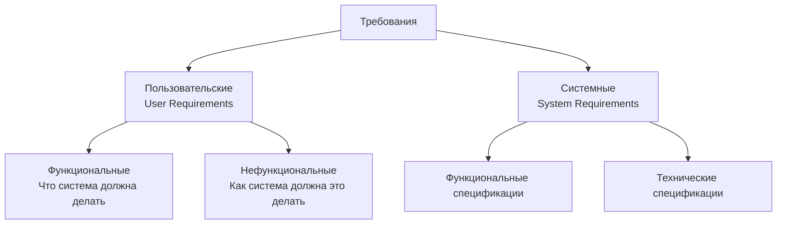

# Теоретическая основа для занятия  
**«Формирование требований пользователя к информационной системе»**

---

## **1. Основные понятия и определения**

### **1.1. Что такое требование?**
**Требование** — это:
- Условие или возможность, которой должна соответствовать система
- Потребность пользователя или заказчика
- Основа для разработки и тестирования

**Формальное определение (IEEE Std 610.12-1990):**
1. **Условие или возможность**, необходимые пользователю для решения задачи или достижения цели
2. **Условие или возможность**, которыми должна обладать система для выполнения контракта, стандарта или другого формального документа

### **1.2. Классификация требований**

#### **По источнику:**


#### **По характеру:**
| Тип | Описание | Примеры |
|-----|----------|---------|
| **Функциональные** | Что система должна делать | «Система должна отправлять email уведомление при новом заказе» |
| **Нефункциональные** | Как система должна это делать | «Время отклика системы ≤ 2 секунды для 95% запросов» |
| **Бизнес-требования** | Цели организации | «Увеличить конверсию на 15% за квартал» |
| **Ограничения** | Внешние условия | «Должно работать на Windows 10 и выше» |

---

## **2. Уровни требований**

### **2.1. Иерархия требований**
```
Бизнес-цели (Vision)
    ↓
Пользовательские требования (User Requirements)
    ↓
Системные требования (System Requirements)
    ↓
Технические спецификации (Technical Specifications)
```

### **2.2. Детализация на примере «Интернет-магазин»:**

| Уровень | Пример | Кто формулирует |
|---------|--------|-----------------|
| **Бизнес-требования** | Увеличить онлайн-продажи на 30% | Руководство компании |
| **Пользовательские** | «Как покупатель, я хочу видеть историю заказов» | Пользователи через аналитика |
| **Системные функциональные** | Система должна хранить историю заказов за 2 года | Аналитики + разработчики |
| **Системные нефункциональные** | Загрузка истории заказов ≤ 3 секунд | Архитекторы |
| **Технические спецификации** | Использовать Redis для кэширования | Разработчики |

---

## **3. Качества хороших требований**

### **3.1. Критерии SMART**
- **S**pecific (Конкретное) — четко определено
- **M**easurable (Измеримое) — можно проверить
- **A**chievable (Достижимое) — реализуемо технически
- **R**elevant (Релевантное) — соответствует целям
- **T**ime-bound (Ограниченное по времени) — сроки выполнения

### **3.2. Дополнительные критерии (плюс SMART)**
- **Полное** — покрывает все аспекты
- **Непротиворечивое** — не конфликтует с другими требованиями
- **Однозначное** — только одна интерпретация
- **Прослеживаемое** — связь с бизнес-целями
- **Проверяемое** — можно создать тест для проверки
- **Модифицируемое** — легко изменять без конфликтов

### **3.3. Примеры трансформации плохих требований**

| ❌ Плохое требование | ✅ Хорошее требование | Почему лучше |
|---------------------|----------------------|--------------|
| «Система должна быть удобной» | «Новичок должен выполнять основную задачу за ≤ 5 минут без обучения» | Конкретно, измеримо |
| «Загрузка должна быть быстрой» | «95% страниц должны загружаться за ≤ 2 секунды при скорости 10 Мбит/с» | Измеримо, проверяемо |
| «Должна быть безопасной» | «Система должна проходить пентест раз в квартал с результатом ≤ 3 уязвимости уровня High» | Конкретно, проверяемо |

---

## **4. Методы сбора требований**

### **4.1. Основные методы**

| Метод | Когда использовать | Плюсы | Минусы |
|-------|------------------|-------|--------|
| **Интервью** | Мало экспертов, сложная предметная область | Глубина понимания, контекст | Время, субъективность |
| **Анкетирование** | Много пользователей, простые вопросы | Масштаб, статистика | Поверхностность, низкий отклик |
| **Наблюдение** | Нужно понять реальные процессы | Объективные данные, неочевидные паттерны | Эффект наблюдателя, время |
| **Рабочие сессии** | Нужно согласовать разные мнения | Быстрое согласование, синергия | Конфликты, доминирование |
| **Анализ документов** | Существующие процессы документированы | Факты, не требует пользователей | Может быть устаревшим |
| **Прототипирование** | Сложные интерфейсы, инновации | Наглядность, ранний фидбек | Требует ресурсов, ложные ожидания |

### **4.2. Техники внутри методов**

#### **Для интервью:**
1. **Открытые вопросы:** «Расскажите о вашем рабочем дне»
2. **Закрытые вопросы:** «Сколько заказов обрабатываете в день?»
3. **Техника «5 почему»:** Для выявления корневых причин
4. **Сценарии использования:** «Опишите типичный случай...»

#### **Для рабочих сессий:**
1. **Мозговой штурм** — генерация идей
2. **Аффинити-сортировка** — группировка требований
3. **Приоритизация MoSCoW** — Must, Should, Could, Won't
4. **Моделирование процессов** — BPMN, блок-схемы

---

## **5. Форматы документирования требований**

### **5.1. User Stories (Пользовательские истории)**
**Формат:** «Как [роль], я хочу [функция], чтобы [ценность/цель]»

**Критерии приемки (Acceptance Criteria):**
- Given (Дано) — начальные условия
- When (Когда) — действие пользователя
- Then (Тогда) — ожидаемый результат

**Пример:**
```
Как клиент, я хочу отменить заказ, чтобы вернуть деньги.

Критерии приемки:
1. Given я на странице "Мои заказы"
   When я нажимаю "Отменить" у заказа со статусом "В обработке"
   Then заказ меняет статус на "Отменен"
   And я получаю уведомление об отмене
   And деньги возвращаются на карту в течение 3 дней
```

### **5.2. Use Cases (Варианты использования)**
**Структура:**
1. **Название** (глагол + объект)
2. **Акторы** (кто выполняет)
3. **Предусловия**
4. **Основной поток**
5. **Альтернативные потоки**
6. **Исключения**
7. **Постусловия**

### **5.3. SRS (Software Requirements Specification)**
**Стандартная структура по IEEE 830:**
1. Введение
2. Общее описание
3. Специфические требования
   - 3.1 Функциональные требования
   - 3.2 Требования к интерфейсам
   - 3.3 Требования к производительности
   - 3.4 Требования к безопасности
   - 3.5 Атрибуты качества

---

## **6. Приоритизация требований**

### **6.1. Метод MoSCoW**
- **MUST** — обязательно для релиза, без этого система не работает
- **SHOULD** — важно, но можно отложить если не успеваем
- **COULD** — желательно, улучшает пользовательский опыт
- **WON'T** — не в этом релизе, но может быть позже

### **6.2. Матрица приоритетов (важность vs сложность)**
```
СЛОЖНОСТЬ
  ↑
  |   2. Сделать позже    | 1. Сделать в первую очередь
  |   (низкая важность,   | (высокая важность,
  |    высокая сложность) |  низкая сложность)
  |
  |   3. Не делать        | 4. Сделать если останется время
  |   (низкая важность,   | (высокая важность,
  |    низкая сложность)  |  высокая сложность)
  |
  +----------------------→ ВАЖНОСТЬ
```

### **6.3. Метод Kano**
- **Базовые** — ожидаемые, без них недовольство
- **Ожидаемые** — чем больше, тем лучше, линейная зависимость
- **Восхищающие** — неожиданные, создают восторг
- **Безразличные** — не влияют на удовлетворенность
- **Нежелательные** — вызывают недовольство

---

## **7. Типичные ошибки и проблемы**

### **7.1. Антипаттерны в требованиях**
1. **«Золотая пуля»** — одно требование решает все проблемы
2. **«Прокрустово ложе»** — жесткие требования без гибкости
3. **«Требование-невидимка»** — все понимают, но не записано
4. **«Капитан Очевидность»** — тривиальные требования
5. **«Функциональный крестовый поход»** — избыточные функции

### **7.2. Конфликты требований**
**Типы конфликтов:**
- **Ресурсные** — ограничения времени/бюджета
- **Целевые** — разные стейкхолдеры хотят разное
- **Технические** — противоречивые технические решения

**Способы разрешения:**
1. Переговоры и компромиссы
2. Приоритизация
3. Поиск альтернативных решений
4. Эскалация к спонсору проекта

### **7.3. Эффект «размытия» требований**
**Причины:**
- Слишком абстрактные формулировки
- Отсутствие критериев приемки
- Смешение разных уровней требований

**Решение:** Проводить ревью требований по чек-листу качества.

---

## **8. Инструменты и техники**

### **8.1. Визуальные техники**
1. **Карта стейкхолдеров** — влияние vs интерес
2. **Диаграмма Ишикавы** — анализ причин и следствий
3. **Mind maps** — структурирование информации
4. **Диаграммы UML** — Use Case, Activity, Sequence

### **8.2. Программные инструменты**
- **Управление требованиями:** JIRA, Confluence, Trello
- **Прототипирование:** Figma, Adobe XD, Balsamiq
- **Диаграммы:** draw.io, Lucidchart, PlantUML
- **Совместная работа:** Miro, Mural, Google Docs

### **8.3. Метрики качества требований**
- **Плотность дефектов** — ошибок на 100 требований
- **Стабильность** — % неизменившихся требований
- **Полнота** — покрытие всех сценариев
- **Ясность** — оценка по обратной связи команды

---

## **9. Психологические аспекты**

### **9.1. Коммуникационные навыки аналитика**
1. **Активное слушание** — перефразирование, уточнение
2. **Эмпатия** — понимание контекста пользователя
3. **Фасилитация** — ведение дискуссий
4. **Управление конфликтами** — поиск win-win решений

### **9.2. Когнитивные искажения**
- **Эффект знания** — «это и так очевидно»
- **Эффект рамки** — зависимость от формулировки
- **Предвзятость подтверждения** — поиск подтверждений своей гипотезе
- **Проклятие знания** — сложность объяснить простыми словами

### **9.3. Работа с сопротивлением**
**Причины сопротивления:**
- Страх изменений
- Непонимание выгод
- Потеря контроля

**Стратегии преодоления:**
1. Вовлечение на ранних этапах
2. Прозрачность процессов
3. Демонстрация преимуществ
4. Постепенные изменения

---

## **10. Современные подходы и тренды**

### **10.1. Agile и требования**
- **Живые требования** — постоянно уточняются
- **Минимально жизнеспособный продукт (MVP)** — фокус на ценность
- **User Story Mapping** — визуализация пользовательского пути
- **Behavior Driven Development (BDD)** — требования как тесты

### **10.2. Data-driven подход**
- **Аналитика поведения** — heat maps, session recordings
- **A/B тестирование** — проверка гипотез
- **Предиктивная аналитика** — предсказание потребностей

### **10.3. Документирование в цифровую эпоху**
- **Единый источник истины** — все требования в одном месте
- **Автоматизированная прослеживаемость** — связь требований-кода-тестов
- **Интерактивная документация** — Swagger для API, Storybook для UI

---

## **Ключевые выводы для студентов**

1. **Требования — это гипотеза** о том, что нужно пользователю, которую нужно проверять
2. **Лучшее требование — проверенное требование** (прототипами, тестами, исследованиями)
3. **Качество требований определяет 70% успеха проекта**
4. **Сбор требований — это наука + искусство** (техники + коммуникация)
5. **Требования должны жить и эволюционировать** вместе с продуктом

---

## **Рекомендуемая литература**

1. **Karl E. Wiegers** — «Software Requirements»
2. **Alistair Cockburn** — «Writing Effective Use Cases»
3. **Mike Cohn** — «User Stories Applied»
4. **Steve McConnell** — «Rapid Development»
5. **Гэри Маклин Холл** — «Спросить нельзя разработать»

## **Стандарты и руководства**
- IEEE 830-1998 — Рекомендации по спецификации требований
- ISO/IEC/IEEE 29148 — Процессы и документация требований
- BABOK Guide — Свод знаний по бизнес-анализу

*Эта теория составляет основу для практического занятия и дает студентам необходимый контекст для выполнения заданий.*
