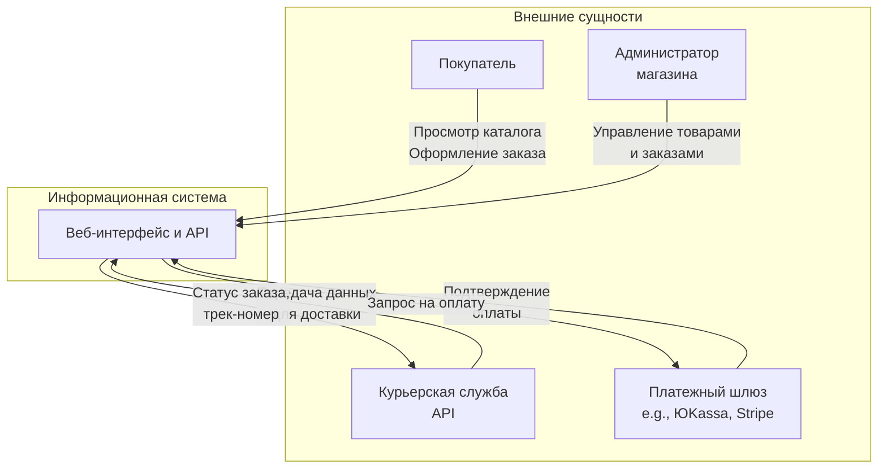
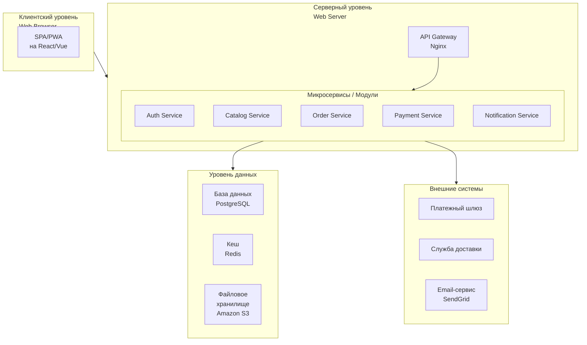
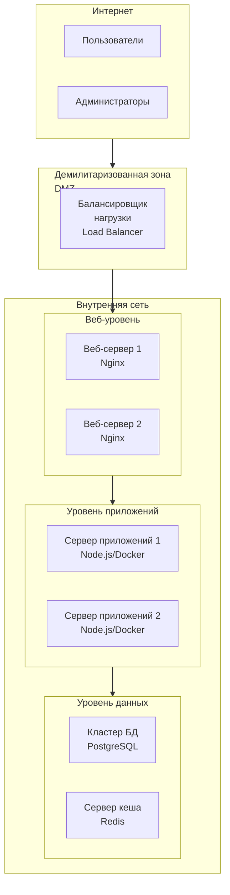
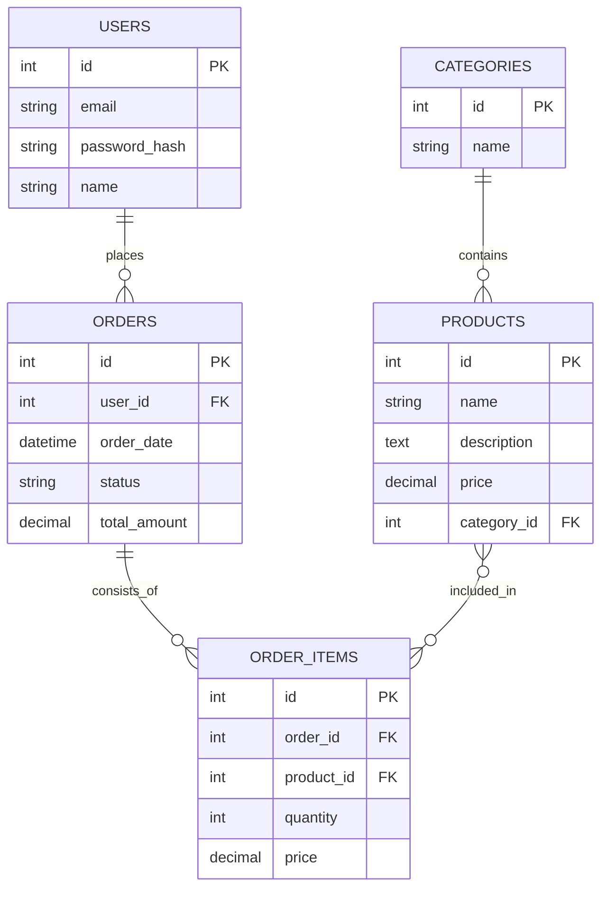

Отличный выбор темы! Разработка модели архитектуры — это визуализация того, **как** система будет работать, чтобы удовлетворить все требования заказчика.

Разберем на конкретном примере.

---

### **УП.05: Разработка модели архитектуры ИС на примере "Интернет-магазин"**

**Цель:** Спроектировать и отобразить графически основные компоненты системы, их взаимодействие и место в общей структуре.

---

### **1. Выбор типа архитектуры**

Для веб-приложений, таких как интернет-магазин, наиболее распространена **трехуровневая (трехзвенная) архитектура**. Она обеспечивает модульность, масштабируемость и безопасность.

*   **Уровень 1 (Presentation Layer):** Клиентская часть (то, что видит пользователь в браузере).
*   **Уровень 2 (Business Logic Layer):** Серверная часть (мозг системы, где выполняются все операции).
*   **Уровень 3 (Data Access Layer):** Уровень данных (где хранится информация).

---

### **2. Декомпозиция архитектуры на модели (диаграммы)**

Одной картинкой архитектуру не описать. Нужно создать несколько взаимосвязанных моделей.

#### **Модель 1: Контекстная диаграмма (Диаграмма окружения)**

**Задача:** Показать, с какими внешними системами и субъектами будет взаимодействовать наша ИС.

**Пример для интернет-магазина:**

*   **Компоненты:**
    *   **Покупатель:** Взаимодействует с системой через браузер.
    *   **Платежный шлюз:** Внешняя система для приема платежей (например, ЮKassa).
    *   **Курьерская служба:** Внешняя система для передачи данных о доставке и получения трек-номера.
    *   **Администратор магазина:** Управляет контентом и заказами через админ-панель.

---

#### **Модель 2: Компонентная диаграмма (Логическая архитектура)**

**Задача:** Показать основные программные модули (компоненты) системы и связи между ними.

*   **Компоненты:**
    *   **Frontend (Клиентское приложение):** Отвечает за отображение интерфейса (React, Vue.js).
    *   **Backend (Серверное приложение):**
        *   **API Gateway:** Единая точка входа для всех запросов.
        *   **Модуль аутентификации (Auth):** Регистрация, вход, управление сессиями.
        *   **Модуль каталога (Catalog):** Управление товарами, категориями, остатками.
        *   **Модуль заказов (Order):** Формирование корзины, оформление и отслеживание заказов.
        *   **Модуль оплаты (Payment):** Взаимодействие с платежным шлюзом.
        *   **Модуль уведомлений (Notification):** Отправка email и SMS.
    *   **Уровень данных (Data Layer):**
        *   **База данных (PostgreSQL/MySQL):** Основное хранилище структурированных данных.
        *   **Кеш (Redis):** Для хранения сессий и временных данных (например, корзина).
        *   **Файловое хранилище (S3):** Для изображений товаров и документов.

---

#### **Модель 3: Физическая архитектура (Деплоймент-диаграмма)**

**Задача:** Показать, на каких реальных или виртуальных серверах будут развернуты компоненты системы.

*   **Компоненты:**
    *   **Балансировщик нагрузки (Load Balancer):** Распределяет трафик между веб-серверами.
    *   **Веб-серверы (Nginx):** Отдают статический контент (HTML, CSS, JS) и проксируют запросы к серверам приложений.
    *   **Серверы приложений (Node.js, Java):** На них развернута бэкенд-логика. Запущены в контейнерах Docker для простоты развертывания.
    *   **Кластер БД:** Основная база данных с репликацией для надежности.
    *   **Сервер кеша (Redis):** Отдельный сервер для быстрого доступа к временным данным.

---

#### **Модель 4: Модель данных (ER-диаграмма)**

**Задача:** Показать структуру базы данных — сущности, их атрибуты и связи.

*(Упрощенный пример)*

---

### **Как оформить в отчете по УП.05**

1.  **Введение:** Обоснование выбранного типа архитектуры (трехуровневая, микросервисная).
2.  **Диаграммы:** Представить все 4 модели с подробными пояснениями к каждому компоненту.
3.  **Связь с требованиями:** Показать, как архитектура удовлетворяет функциональным и нефункциональным требованиям (например, использование балансировщика нагрузки для обеспечения надежности).
4.  **Вывод:** Краткое резюме, почему предложенная архитектура является оптимальной для проекта.

Эта работа покажет, что вы понимаете не только *что* делать, но и *как* это должно быть реализовано на практике.
