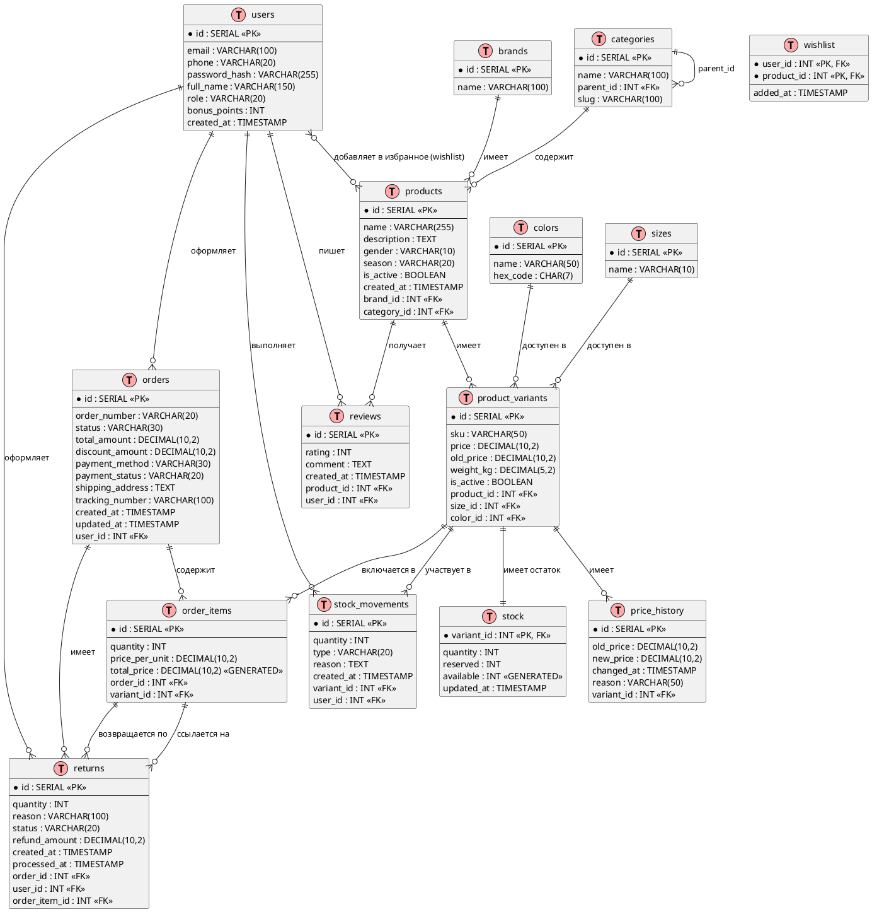

**полноценная ER-диаграмма в формате PlantUML** для информационной системы магазина одежды. Она включает все таблицы, связи, типы отношений и ключевые поля.

---

## 📐 ER-диаграмма (PlantUML)



---

## 📋 Легенда и расшифровка

### Обозначения связей:
- `||--||` — один к одному (1:1)
- `||--o{` — один ко многим (1:N)
- `}o--o{` — многие ко многим (M:N) с промежуточной таблицей
- `||--||` — обязательная связь
- `}o--||` — необязательная связь (может быть NULL)

### Ключевые особенности:

| Элемент | Пояснение |
| :--- | :--- |
| **`<<PK>>`** | Первичный ключ |
| **`<<FK>>`** | Внешний ключ |
| **`<<GENERATED>>`** | Вычисляемое поле (не хранится, считается автоматически) |
| **`categories.parent_id`** | Самореференция для создания дерева категорий (родитель-потомок) |
| **`wishlist`** | Таблица-связка M:N между пользователями и товарами |
| **`stock.available`** | Виртуальное поле = `quantity - reserved` |

---

## 🔍 Как читать диаграмму (пример)

1. **`products`** имеет связь **1:N** с **`product_variants`**  
   → Один товар (например, "Куртка") может иметь много вариантов (S/чёрный, M/чёрный, S/синий)

2. **`product_variants`** связана **1:1** с **`stock`**  
   → У каждого варианта есть ровно одна запись с остатками

3. **`orders`** и **`order_items`** — связь **1:N**  
   → Один заказ состоит из нескольких позиций

4. **`wishlist`** — связь **M:N** между **`users`** и **`products`**  
   → Один пользователь может добавить много товаров, один товар могут добавить много пользователей

---

## 🛠 Как использовать этот код

1. Скопируйте код в любой редактор PlantUML:
   - Онлайн: [PlantUML Web Server](https://www.plantuml.com/plantuml/uml/)
   - VS Code: установите расширение "PlantUML"
   - IntelliJ IDEA: плагин PlantUML

2. На выходе получите **визуальную ER-диаграмму** с цветовым кодированием:
   - Розовые блоки — таблицы
   - Зелёные — представления (если появятся)

---

## 📦 Что можно добавить (опционально)

Если бизнес-требования вырастут, добавьте:

```plantuml
' Скидки и промокоды
TABLE(promocodes) {
  * id : SERIAL <<PK>>
  code : VARCHAR(50)
  discount_percent : DECIMAL(5,2)
  valid_from : TIMESTAMP
  valid_to : TIMESTAMP
  usage_limit : INT
}

TABLE(order_promocodes) {
  * order_id : INT <<PK, FK>>
  * promocode_id : INT <<PK, FK>>
}
```

```plantuml
' Уведомления
TABLE(notifications) {
  * id : SERIAL <<PK>>
  user_id : INT <<FK>>
  type : VARCHAR(30)
  message : TEXT
  is_read : BOOLEAN
  created_at : TIMESTAMP
}
```

---

## ✅ Резюме

- Диаграмма содержит **14 таблиц**, покрывающих весь бизнес-цикл магазина одежды
- Учтена **специфика товаров** (размеры, цвета, SKU)
- Реализованы **складские операции**, **возвраты** и **история цен**
- Готова к **масштабированию** (добавление промокодов, уведомлений, аналитики)

 можно:
- Сгенерировать **SQL-скрипт** для создания всех таблиц
- Добавить **индексы** для ускорения запросов
- Написать **примеры запросов** (выборка каталога с остатками, создание заказа и т.д.)


