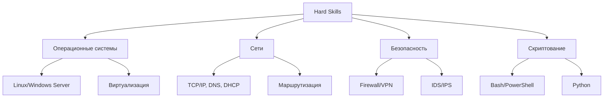
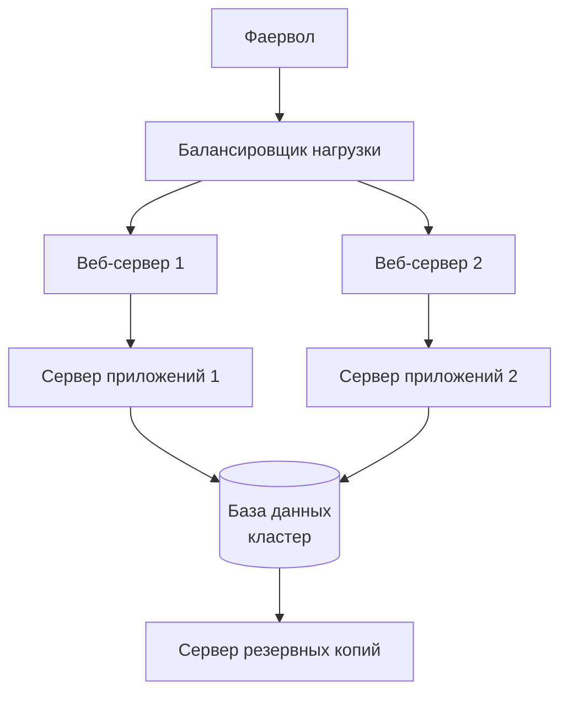
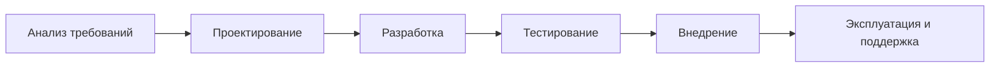

# **ЛЕКЦИОННЫЙ МАТЕРИАЛ**
## **Тема 1.1: Введение в администрирование ИС (6 часов)**

---

## **ЧАСТЬ 1: РОЛЬ СИСТЕМНОГО АДМИНИСТРАТОРА (2 часа)**

### **1.1. Кто такой системный администратор?**

**Системный администратор (сисадмин, админ, IT-администратор)** — это специалист, отвечающий за работоспособность, безопасность и развитие информационной инфраструктуры организации.

**Аналогия:** Если организация — это организм, то системный администратор — это:
- **Иммунная система** (защита от угроз)
- **Нервная система** (коммуникации и управление)
- **Кровеносная система** (передача данных)
- **Врач** (диагностика и лечение проблем)

### **1.2. Исторический контекст**

**Эволюция профессии:**
```
1980-е: Оператор ЭВМ → 1990-е: Сетевой администратор → 2000-е: Системный администратор → 2010-е: DevOps/SRE → 2020-е: Cloud/Platform Engineer
```

**Интересный факт:** Первым системным администратором в мире считается **Уэсли Кларк**, создатель компьютера LINC в 1960-х годах.

### **1.3. Основные обязанности системного администратора**

#### **Технические обязанности:**
1. **Установка и настройка:**
   - Серверного оборудования и ПО
   - Сетевого оборудования
   - Рабочих станций пользователей

2. **Обслуживание и мониторинг:**
   ```bash
   # Пример мониторинга в Linux
   $ top                    # Мониторинг процессов
   $ df -h                  # Свободное место на дисках
   $ netstat -tulpn         # Сетевые соединения
   $ journalctl -f          # Просмотр логов в реальном времени
   ```

3. **Безопасность:**
   - Настройка брандмауэров
   - Управление правами доступа
   - Защита от вирусов и атак
   - Резервное копирование

4. **Поддержка пользователей:**
   - Консультации
   - Решение проблем
   - Обучение

#### **Административные обязанности:**
- Документирование инфраструктуры
- Планирование бюджета IT-отдела
- Ведение технической документации
- Взаимодействие с вендорами

### **1.4. Навыки и компетенции**

#### **Hard Skills (технические навыки):**


#### **Soft Skills (личностные качества):**
1. **Коммуникабельность** — общение с пользователями разного уровня подготовки
2. **Стрессоустойчивость** — работа в условиях сбоев и дедлайнов
3. **Аналитическое мышление** — поиск корневых причин проблем
4. **Обучаемость** — постоянное изучение новых технологий
5. **Ответственность** — от работы админа зависит функционирование всей организации

### **1.5. Карьерные пути**

**Вертикальный рост:**
```
Младший администратор → Администратор → Старший администратор → Руководитель IT-отдела → CIO (Директор по IT)
```

**Горизонтальный рост (специализация):**
- **Сетевой администратор** — сети, маршрутизация
- **Администратор БД** — базы данных
- **Администратор безопасности** — защита информации
- **DevOps инженер** — автоматизация и CI/CD
- **Cloud инженер** — облачные технологии

### **1.6. Этический кодекс системного администратора**

**Принципы:**
1. **Конфиденциальность** — не разглашать информацию пользователей
2. **Невмешательство** — не изменять данные без необходимости
3. **Профессионализм** — использовать знания только в законных целях
4. **Честность** — признавать ошибки и исправлять их
5. **Развитие** — постоянно совершенствовать навыки

**Реальная история:** В 2015 году системный администратор одной из американских компаний, будучи уволенным, установил "логическую бомбу", которая удаляла данные. Он получил 2 года тюрьмы.

### **1.7. Инструменты системного администратора**

#### **Ежедневные инструменты:**
```bash
# Терминал (для Linux-админов)
$ ssh user@server         # Удаленное подключение
$ grep "error" /var/log/syslog  # Поиск ошибок в логах
$ rsync -avz source/ destination/  # Синхронизация файлов

# GUI инструменты (для Windows-админов)
- Remote Desktop Connection
- Active Directory Users and Computers
- Server Manager
```

#### **Современные инструменты:**
- **Ansible/Puppet/Chef** — управление конфигурациями
- **Docker/Kubernetes** — контейнеризация
- **Terraform** — инфраструктура как код
- **Prometheus/Grafana** — мониторинг
- **Git** — контроль версий конфигураций

---

## **ЧАСТЬ 2: КЛАССИФИКАЦИЯ ИНФОРМАЦИОННЫХ СИСТЕМ (2 часа)**

### **2.1. Что такое информационная система (ИС)?**

**Определение:** Информационная система — это совокупность взаимосвязанных компонентов, которые собирают, обрабатывают, хранят и распространяют информацию для поддержки принятия решений, координации и контроля в организации.

**Компоненты ИС:**
```
ЛЮДИ (пользователи, администраторы)
↓
ПРОЦЕДУРЫ (инструкции, политики)
↓
ДАННЫЕ (базы данных, файлы)
↓
ОБОРУДОВАНИЕ (серверы, сети, ПК)
↓
ПРОГРАММНОЕ ОБЕСПЕЧЕНИЕ (ОС, приложения)
```

### **2.2. Классификация по масштабу**

#### **1. Персональные ИС**
**Характеристики:**
- Один пользователь
- Один компьютер
- Примеры: Домашний ПК, ноутбук

**Задачи админа:**
- Резервное копирование
- Антивирусная защита
- Обновление ПО

#### **2. Локальные ИС (малый бизнес)**
**Характеристики:**
- 5-50 пользователей
- 1-3 сервера
- Пример: офис небольшой компании

**Архитектура:**
```
[Сервер]
   ↓
[Коммутатор]
   ↓
[ПК1] [ПК2] [ПК3] ... [ПК20]
```

**Задачи админа:**
- Настройка файлового сервера
- Организация общего доступа
- Резервное копирование
- Базовая безопасность

#### **3. Корпоративные ИС**
**Характеристики:**
- 50-5000 пользователей
- Десятки серверов
- Пример: средняя/крупная компания

**Архитектура:**


**Задачи админа (команда специалистов):**
- Администрирование домена (Active Directory)
- Управление сетевыми сервисами
- Мониторинг высокой доступности
- Сложные схемы резервирования

#### **4. Глобальные ИС**
**Характеристики:**
- Тысячи пользователей
- Географически распределенная инфраструктура
- Примеры: Google, Amazon, банковские системы

**Задачи админа:**
- Автоматизация всех процессов
- Управление облачными ресурсами
- Обеспечение отказоустойчивости
- Соблюдение регуляторных требований

### **2.3. Классификация по назначению**

#### **1. Офисные ИС**
**Примеры:**
- Microsoft 365 / Google Workspace
- Системы документооборота
- Корпоративная почта

**Особенности администрирования:**
- Управление лицензиями
- Интеграция различных сервисов
- Обеспечение доступности

#### **2. Производственные ИС**
**Примеры:**
- ERP (Enterprise Resource Planning) — SAP, 1C
- CRM (Customer Relationship Management) — Salesforce
- SCADA (Supervisory Control And Data Acquisition)

**Особенности:**
- Высокие требования к надежности
- Критичность времени простоя
- Специфические протоколы связи

#### **3. Специализированные ИС**
**Примеры:**
- Медицинские информационные системы
- Банковские системы
- Образовательные платформы

**Требования:**
- Соответствие отраслевым стандартам
- Защита персональных данных
- Аудит всех операций

### **2.4. Классификация по архитектуре**

#### **1. Файл-серверные ИС**
**Архитектура (устаревшая, но еще встречается):**
```
[Файловый сервер]
       ↓ (сетевые папки)
[ПК1]    [ПК2]    [ПК3]
```

**Проблемы:**
- Высокая сетевая нагрузка
- Сложности с согласованностью данных
- Ограничения масштабирования

#### **2. Клиент-серверные ИС**
**Двухзвенная архитектура:**
```
[Клиентское приложение]
           ↓ (SQL-запросы)
      [Сервер БД]
```

**Трехзвенная архитектура (современный стандарт):**
```
[Веб-браузер/Тонкий клиент]
           ↓ (HTTP/HTTPS)
      [Сервер приложений]
           ↓ (SQL)
      [Сервер БД]
```

**Преимущества:**
- Централизованное управление
- Лучшая безопасность
- Легкое масштабирование

#### **3. Облачные ИС**
**Модели обслуживания:**
- **IaaS** (Infrastructure as a Service) — AWS EC2, Azure VMs
- **PaaS** (Platform as a Service) — Heroku, Google App Engine
- **SaaS** (Software as a Service) — Office 365, Salesforce

**Задачи админа в облаке:**
- Управление через API
- Оптимизация затрат
- Обеспечение безопасности в общей ответственности

### **2.5. Классификация по степени автоматизации**

#### **1. Ручные ИС**
- Все операции выполняются человеком
- Пример: бумажный архив

#### **2. Автоматизированные ИС**
- Компьютер помогает человеку
- Пример: электронная почта + человек-оператор

#### **3. Автоматические ИС**
- Минимальное участие человека
- Пример: торговые роботы на бирже

**Тренд:** переход к автономным системам с самоисцелением (self-healing systems).

---

## **ЧАСТЬ 3: ЖИЗНЕННЫЙ ЦИКЛ ИНФОРМАЦИОННОЙ СИСТЕМЫ (2 часа)**

### **3.1. Модели жизненного цикла**

#### **Каскадная модель (Waterfall)**


**Плюсы:** 
- Четкое планирование
- Хорошая документация

**Минусы:**
- Сложно вносить изменения
- Долгий цикл

**Роль админа:** Участвует только на этапах внедрения и эксплуатации.

#### **Итеративная модель**
**Пример: Модель спирали Боэма**
```
Планирование → Анализ рисков → Разработка → Оценка
      ↑                                   ↓
      ←←←←←←←←←←←←←←←←←←←←←←←←←←←←←←←←←←←
```

**Роль админа:** Участвует в каждой итерации, тестирует и дает обратную связь.

#### **Agile/DevOps подход**
```
Разработка → Тестирование → Внедрение → Мониторинг
     ↑                                         ↓
     ←←←←←←←←←←←←←←←←←←←←←←←←←←←←←←←←←←←←←←←←←
```

**Роль админа:** Неотъемлемая часть команды с самого начала проекта.

### **3.2. Этапы жизненного цикла ИС (подробно)**

#### **Этап 1: Планирование и анализ (Pre-Implementation)**
**Задачи:**
- Определение требований бизнеса
- Технико-экономическое обоснование
- Выбор технологий
- Оценка рисков

**Документы:**
- Техническое задание (ТЗ)
- План проекта
- Бюджет

**Роль админа:** Консультации по технической реализуемости, оценка инфраструктурных требований.

#### **Этап 2: Проектирование (Design)**
**Архитектурное проектирование:**
```yaml
# Пример архитектуры в YAML
infrastructure:
  web_servers:
    count: 2
    type: nginx
    load_balancing: round-robin
  
  database:
    type: postgresql
    replication: master-slave
    backup: daily
    
  monitoring:
    tools: [prometheus, grafana]
    alerts: [email, telegram]
```

**Роль админа:** Разработка схемы развертывания, планирование мониторинга, выбор инструментов.

#### **Этап 3: Разработка и тестирование (Development & Testing)**
**Тестовые среды:**
```
Разработка (dev) → Тестирование (test) → Промежуточная (stage) → Продуктивная (prod)
```

**Роль админа:**
- Настройка тестовых сред
- Обеспечение изоляции сред
- Автоматизация развертывания

#### **Этап 4: Внедрение (Implementation/Deployment)**
**Стратегии внедрения:**
1. **Прямая замена** (Big Bang) — рискованно, но быстро
2. **Параллельная работа** — безопасно, но дорого
3. **Поэтапное внедрение** — оптимальный баланс
4. **Пилотный проект** — тестирование на части пользователей

**Чеклист развертывания:**
```bash
# Пример скрипта развертывания
#!/bin/bash
# 1. Проверка зависимостей
check_dependencies() {
    which docker || error "Docker not installed"
    which git || error "Git not installed"
}

# 2. Получение кода
git clone https://github.com/company/app.git

# 3. Сборка и запуск
docker-compose up -d

# 4. Проверка работоспособности
curl http://localhost:8080/health || error "Application not healthy"
```

**Роль админа:** Выполнение миграции, минимизация простоя, откат при проблемах.

#### **Этап 5: Эксплуатация и поддержка (Operation & Maintenance)**
**Виды поддержки:**
- **Превентивная** — обновления, мониторинг
- **Корректирующая** — исправление ошибок
- **Адаптивная** — адаптация к изменениям
- **Совершенствующая** — улучшение производительности

**ITIL процессы:**
```
Инцидент → Проблема → Изменение → Релиз
```

**Роль админа:** Ежедневное обслуживание, реагирование на инциденты, оптимизация.

#### **Этап 6: Вывод из эксплуатации (Decommissioning)**
**Процесс:**
1. Анализ зависимостей
2. Миграция данных
3. Отключение сервисов
4. Утилизация оборудования
5. Архивация документации

**Роль админа:** Обеспечение непрерывности бизнеса, безопасное удаление данных.

### **3.3. Метрики жизненного цикла**

#### **Технические метрики:**
```python
# Расчет доступности
def calculate_availability(downtime_minutes, total_minutes):
    availability = ((total_minutes - downtime_minutes) / total_minutes) * 100
    return availability

# SLA уровни:
# - 99% = 3.65 дней простоя в год
# - 99.9% = 8.76 часов простоя в год  
# - 99.99% = 52.56 минут простоя в год
# - 99.999% = 5.26 минут простоя в год
```

#### **Бизнес-метрики:**
- **TCO** (Total Cost of Ownership) — общая стоимость владения
- **ROI** (Return On Investment) — возврат инвестиций
- **MTBF** (Mean Time Between Failures) — среднее время между сбоями
- **MTTR** (Mean Time To Repair) — среднее время восстановления

### **3.4. Документация на разных этапах**

**Техническая документация:**
```
1. Паспорт ИС
2. Руководство администратора
3. Руководство пользователя  
4. Аварийные процедуры
5. Схемы и диаграммы
```

**Операционная документация:**
- Ежедневные чек-листы
- Журналы изменений
- Отчеты о инцидентах
- Планы резервного копирования

### **3.5. Практический кейс: Внедрение корпоративной почты**

**Контекст:** Компания из 100 человек использует бесплатные почтовые ящики. Нужно внести корпоративную почту.

**Жизненный цикл:**
1. **Анализ:** Требования: 100 ящиков, календари, общие папки, мобильный доступ
2. **Проектирование:** Выбор Google Workspace, план миграции
3. **Тестирование:** Пилот на 10 пользователях
4. **Внедрение:** Поэтапная миграция по отделам
5. **Эксплуатация:** Ежедневный мониторинг, квоты, резервирование
6. **Развитие:** Интеграция с CRM, автоматизация процессов

**Роль админа на каждом этапе:**
- Консультации по выбору
- Настройка DNS-записей
- Миграция данных
- Обучение пользователей
- Поддержка и развитие

---

## **ИНТЕРАКТИВНАЯ ЧАСТЬ ЛЕКЦИИ**

### **Кейс для обсуждения:**

**Ситуация:** Вы — единственный системный администратор в компании из 50 человек. В понедельник утром:
1. Не работает интернет
2. Сервер бухгалтерии не запускается
3. 3 пользователя не могут войти в систему
4. Директор требует срочно установить новую программу
5. В 14:00 запланировано обновление CRM системы

**Вопросы для аудитории:**
1. В каком порядке решать проблемы? Почему?
2. Какие инструменты использовать для диагностики?
3. Как коммуницировать с пользователями и руководством?
4. Что делать, если не хватает знаний/ресурсов?
5. Как предотвратить подобные ситуации в будущем?

### **Практическое задание:**

**Задание 1:** Разработайте ролевую модель системного администратора для:
- Школы (300 компьютеров)
- Интернет-магазина (10 сотрудников, 1000 заказов в день)
- Банка (1000 сотрудников, критичные транзакции)

**Задание 2:** Нарисуйте схему жизненного цикла ИС для:
- Внедрения системы видеонаблюдения
- Перехода на облачные сервисы
- Разработки собственного мобильного приложения

### **Контрольные вопросы:**

1. Какие три главные обязанности системного администратора вы считаете наиболее важными?
2. Чем отличается администрирование малой и крупной ИС?
3. Почему жизненный цикл ИС часто сравнивают с жизненным циклом живого организма?
4. Как изменилась роль системного администратора за последние 10 лет?
5. Какие этические дилеммы могут возникнуть у системного администратора?

### **Домашнее задание:**

1. **Исследование:** Найдите 3 вакансии системного администратора на hh.ru. Проанализируйте:
   - Требуемые навыки
   - Уровень зарплаты
   - Обязанности
   - Составьте список знаний, которые нужно получить

2. **Практика:** Установите VirtualBox и создайте виртуальную машину с Ubuntu Server.
   - Настройте статический IP
   - Установите SSH
   - Создайте пользователя
   - Сделайте скриншоты каждого этапа

3. **Анализ:** Выберите любую известную ИС (ВКонтакте, Сбербанк Online и т.д.).
   - Определите ее тип по классификации
   - Предположите архитектуру
   - Опишите возможные роли администраторов в этой системе

---

## **ДОПОЛНИТЕЛЬНЫЕ МАТЕРИАЛЫ**

### **Рекомендуемая литература:**
1. **Томас Лимончелли "Тайм-менеджмент для системных администраторов"** — о приоритизации задач
2. **Майкл Лукас "Абсолютная FreeBSD"** — о философии администрирования
3. **Gene Kim "The Phoenix Project"** — роман о DevOps и IT-менеджменте

### **Полезные ресурсы:**
1. **Хабр** (habr.com) — разделы "Администрирование", "Инфраструктура"
2. **Server Fault** (serverfault.com) — вопросы и ответы для системных администраторов
3. **Реддит** (reddit.com/r/sysadmin) — сообщество администраторов
4. **ИБС "Паладин"** — журнал по информационной безопасности

### **Профессиональные сообщества:**
1. **Русскоязычное сообщество DevOps** (devops.ru)
2. **Московский клуб системных администраторов**
3. **Конференции:** DevOpsConf, HighLoad++, РИТ++

---

## **СЦЕНАРИЙ ПРОВЕДЕНИЯ ЛЕКЦИИ**

### **Структура 6-часовой лекции:**

**Блок 1: Введение (30 минут)**
- Знакомство с преподавателем и предметом
- Цели и задачи курса
- Представление темы

**Блок 2: Роль системного администратора (90 минут)**
- Лекционный материал (60 мин)
- Кейс-стади (30 мин)
- *Перерыв 15 минут*

**Блок 3: Классификация ИС (90 минут)**
- Лекционный материал (60 мин)
- Практическое задание в группах (30 мин)
- *Обед 45 минут*

**Блок 4: Жизненный цикл ИС (90 минут)**
- Лекционный материал (60 мин)
- Интерактивное обсуждение (30 мин)

**Блок 5: Подведение итогов (45 минут)**
- Ответы на вопросы
- Разбор домашнего задания
- Рефлексия и обратная связь

### **Методы активизации аудитории:**

1. **"Мозговой штурм"** — Что делает системный администратор в первый час рабочего дня?
2. **Групповая работа** — Классифицировать известные ИС (Яндекс, Сбер, ВК)
3. **Ролевая игра** — Распределить роли в IT-отделе компании
4. **Голосование** — Какая классификация ИС наиболее важна?
5. **Вопрос-ответ** с использованием Mentimeter или аналогичных инструментов

### **Визуальное сопровождение:**

1. **Презентация** с инфографикой
2. **Видео-примеры:** 
   - Как выглядит дата-центр
   - Рабочее место системного администратора
   - Процесс развертывания сервера
3. **Живые демонстрации:**
   - Командная строка Linux
   - Панель управления Windows Server
   - Инструменты мониторинга

### **Критерии оценки участия:**
- Активность в обсуждениях: 0-3 балла
- Качество выполнения групповых заданий: 0-4 балла
- Ответы на контрольные вопросы: 0-3 балла
- **Итого за занятие: максимум 10 баллов**

---

**Лекцию подготовил:** [ФИО преподавателя]
**Дата:** [Текущая дата]
**Следующая тема:** "Архитектура информационных систем"
