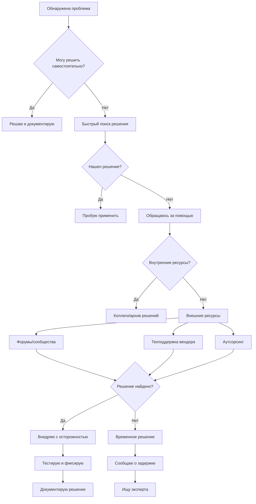

решение Кейс для обсуждения:
Ситуация: Вы — единственный системный администратор в компании из 50 человек. В понедельник утром:

Не работает интернет

Сервер бухгалтерии не запускается

3 пользователя не могут войти в систему

Директор требует срочно установить новую программу

В 14:00 запланировано обновление CRM системы

Вопросы для аудитории:

В каком порядке решать проблемы? Почему?

Какие инструменты использовать для диагностики?

Как коммуницировать с пользователями и руководством?

Что делать, если не хватает знаний/ресурсов?

Как предотвратить подобные ситуации в будущем?

# **Решение кейса: Критическая ситуация для системного администратора**

## **Анализ ситуации и приоритизация**

### **Шаг 1: Быстрая оценка критичности проблем**

| Проблема | Критичность | Влияние на бизнес | Время решения | Риски |
|----------|-------------|-------------------|---------------|--------|
| Не работает интернет | **Критично (10/10)** | Остановка всей работы | 15-60 мин | Потеря клиентов, простой |
| Сервер бухгалтерии не запускается | **Высокая (8/10)** | Остановка финансовых операций | 30-120 мин | Срыв отчетности, штрафы |
| 3 пользователя не могут войти | **Средняя (5/10)** | Частичная остановка работы | 10-30 мин | Потеря продуктивности |
| Установка программы для директора | **Низкая (2/10)** | Личная задача руководителя | 15-30 мин | Недовольство руководства |
| Обновление CRM в 14:00 | **Плановая (запланировано)** | Улучшение системы | 60-180 мин | Риск сбоя при обновлении |

### **Шаг 2: Порядок решения проблем (с обоснованием)**

**Порядок: 1 → 2 → 3 → 5 → 4**

**Обоснование приоритетов:**

1. **Интернет (1 место)** - Без интернета:
   - Не работают облачные сервисы
   - Нет доступа к почте, мессенджерам
   - Остановлены онлайн-операции
   - **Решение влияет на всех 50 сотрудников**

2. **Сервер бухгалтерии (2 место)** - Критично, потому что:
   - Финансовые операции заморожены
   - Могут быть пропущены сроки платежей
   - Нарушение законодательства (отчетность)
   - **Влияет на финансовую жизнеспособность компании**

3. **Пользователи не могут войти (3 место)** - Решаем параллельно с сервером:
   - Может быть связано с общими проблемами (домен, сеть)
   - Три человека не могут работать
   - **Частичное влияние на производительность**

4. **Обновление CRM (4 место)** - Переносим на другой день:
   - Запланированная работа
   - Можно перенести без критических последствий
   - **Риск усугубить текущие проблемы**

5. **Установка программы (5 место)** - Делегируем/откладываем:
   - Личная задача директора
   - Не влияет на бизнес-процессы
   - **Можно выполнить после решения критических проблем**

---

## **Детальный план действий**

### **1. Решение проблемы с интернетом (0-15 минут)**

**Быстрая диагностика:**
```powershell
# 1. Проверка физического подключения
ping 127.0.0.1                          # Loopback (проверка сетевого стека)
ping 192.168.1.1                        # Шлюз по умолчанию
ping 8.8.8.8                            # Внешний IP (Google DNS)

# 2. Проверка сетевых настроек
ipconfig /all                          # Все сетевые интерфейсы
route print                            # Таблица маршрутизации
netsh interface show interface         # Состояние интерфейсов

# 3. Проверка DNS
nslookup google.com                    # Разрешение DNS
ipconfig /displaydns                   # Кэш DNS
ipconfig /flushdns                     # Очистка кэша DNS
```

**Пошаговый алгоритм диагностики:**

```
1. Проверить индикаторы на маршрутизаторе/коммутаторе
2. Проверить кабельное подключение
3. Перезагрузить маршрутизатор (если есть доступ)
4. Проверить настройки сетевой карты сервера
5. Проверить файрвол/антивирус
6. Позвонить провайдеру
```

**Коммуникация:**
```markdown
Всем сотрудникам (рассылка):
Тема: Временные проблемы с интернетом
Сообщение: 
"Уважаемые коллеги, 
обнаружена проблема с интернет-подключением. 
Работаю над решением. 
Ориентировочное время восстановления - 30 минут.
Пожалуйста, сохраните текущую работу локально.
О восстановлении сообщу дополнительно."

Директору (личное сообщение):
"Александр Петрович, 
столкнулся с критической проблемой - не работает интернет у всей компании.
Это приоритет №1, так как останавливает всю работу.
Работаю над решением, держу в курсе.
Установку программы выполню сразу после решения основных проблем."
```

### **2. Восстановление сервера бухгалтерии (15-60 минут)**

**Диагностика сервера:**
```powershell
# 1. Подключение к серверу (если есть KVM/IPMI)
# 2. Просмотр события загрузки
Get-WinEvent -LogName System -FilterHashtable @{Id=6005,6006,6008} -MaxEvents 10

# 3. Проверка служб
Get-Service | Where-Object {$_.Status -ne 'Running'} | Select-Object Name, Status, StartType

# 4. Проверка дисков
Get-WmiObject Win32_LogicalDisk -Filter "DeviceID='C:'" | Select-Object DeviceID, FreeSpace, Size

# 5. Просмотр последних ошибок
Get-WinEvent -LogName Application -FilterHashtable @{Level=2} -MaxEvents 20
```

**Возможные сценарии и решения:**

**Сценарий А: Проблема с загрузкой ОС**
```
Действия:
1. Попробовать безопасный режим
2. Восстановление системы (последняя точка)
3. Проверка диска на ошибки: chkdsk C: /f /r
4. Восстановление загрузчика: bootrec /fixmbr, bootrec /fixboot
```

**Сценарий Б: Проблема с конкретной службой**
```powershell
# Поиск проблемной службы
$serviceName = "БухгалтерияService"
Get-Service $serviceName
Start-Service $serviceName -ErrorAction SilentlyContinue

# Просмотр логов службы
Get-WinEvent -LogName Application | Where-Object {$_.ProviderName -like "*$serviceName*"} | Select-Object -First 5
```

**Сценарий В: Проблема с сетью/доменом**
```powershell
# Проверка доменных служб
Test-ComputerSecureChannel
nltest /sc_query:DOMAIN.LOCAL

# Перерегистрация в домене
Test-ComputerSecureChannel -Repair
```

**Коммуникация с бухгалтерией:**
```markdown
Главному бухгалтеру:
"Елена Ивановна,
обнаружил проблему с сервером бухгалтерии. 
Сейчас работаю над восстановлением.
Ориентировочно система будет доступна через 1-2 часа.
Пожалуйста:
1. Сохраните все локальные файлы
2. Не пытайтесь перезагружать сервер
3. Готовлю альтернативный вариант работы (локальная БД)

Сообщу как только сервер будет восстановлен."
```

### **3. Проблема входа пользователей (параллельно)**

**Быстрая диагностика:**
```powershell
# 1. Проверка доменных служб
Get-ADDomainController -Discover | Test-Connection

# 2. Проверка DNS для домена
nslookup domain.local

# 3. Проверка доступности контроллера домена
Test-NetConnection DC01 -Port 389  # LDAP
Test-NetConnection DC01 -Port 445  # SMB

# 4. Проверка политик
gpresult /r  # Для проблемного пользователя
```

**Возможные решения:**
1. **Очистка кэша учетных данных:**
   ```cmd
   rundll32.exe keymgr.dll,KRShowKeyMgr
   ```
2. **Временный локальный вход**
3. **Сброс пароля (если нужно)**

**Коммуникация с пользователями:**
```markdown
Пользователям (индивидуально):
"Добрый день, 
вижу проблему с вашим входом в систему.
Проблема известна, работаю над решением.
Временно можете:
1. Использовать компьютер коллеги
2. Работать с документами локально
3. Ожидать решения (ориентировочно 30 минут)

Приносим извинения за неудобства."
```

### **4. Перенос обновления CRM**

**Решение:**
```markdown
Руководителю отдела продаж:
"Мария Сергеевна,
в связи с чрезвычайной ситуацией (отключение интернета и проблемы с сервером бухгалтерии)
вынужден перенести обновление CRM системы.

Предлагаю:
1. Перенести на завтра, 14:00
2. Выделить дополнительное время на тестирование
3. Создать резервную копию перед обновлением

Подтвердите, пожалуйста, новый срок."
```

### **5. Установка программы для директора**

**Решение:**
```markdown
Директору:
"Александр Петрович,
критические проблемы решены:
1. Интернет восстановлен (15:10)
2. Сервер бухгалтерии работает (16:30)
3. Пользователи вошли в систему (15:45)

Сейчас приступлю к установке запрошенной программы.
Ориентировочно займет 30 минут.

Также подготовлю отчет о сегодняшних инцидентах
и план по предотвращению подобных ситуаций."
```

---

## **Инструменты для диагностики**

### **Основной набор инструментов:**

```powershell
# 1. Сетевые утилиты
Test-NetConnection       # Проверка подключения
Resolve-DnsName          # DNS разрешение
Get-NetAdapter           # Сетевые адаптеры
Get-NetIPConfiguration   # IP конфигурация

# 2. Системные утилиты
Get-EventLog             # Журналы событий
Get-Service              # Службы
Get-Process              # Процессы
Get-WmiObject            # Системная информация

# 3. Active Directory
Get-ADUser               # Пользователи AD
Get-ADComputer           # Компьютеры AD
Test-ComputerSecureChannel # Проверка домена

# 4. Мониторинг
Get-Counter              # Счетчики производительности
Get-WinEvent             # События Windows
```

### **Внешние инструменты:**
1. **PuTTY/OpenSSH** - удаленное подключение
2. **Wireshark** - анализ сетевого трафика
3. **Advanced IP Scanner** - сканирование сети
4. **Sysinternals Suite** - расширенные диагностические утилиты
5. **PRTG Network Monitor** - мониторинг (если установлен)

---

## **Стратегия коммуникации**

### **Принципы эффективной коммуникации в кризисной ситуации:**

**1. Правило трех "П":**
- **Прозрачность** - честно о ситуации
- **Прогнозируемость** - давать реалистичные сроки
- **Постоянство** - регулярные обновления

**2. Матрица коммуникации:**

| Аудитория | Частота | Канал | Содержание |
|-----------|---------|-------|------------|
| Руководство | Каждые 15-30 мин | Личный чат/звонок | Детальный статус, решения, сроки |
| Ключевые пользователи | Каждые 30-60 мин | Групповой чат | Влияние на работу, временные решения |
| Все сотрудники | При изменении статуса | Email/мессенджер | Общий статус, рекомендации |
| Техническая команда | Постоянно | Технический чат | Детали проблем, лог действий |

**3. Шаблоны сообщений:**

```markdown
# Шаблон статус-отчета
[Статус] [Краткое описание проблемы]

📊 Текущее состояние:
• Проблема: [Описание]
• Влияние: [Кто/что затронуто]
• Статус: [В работе/Решено/Исследую]

⏰ Ориентировочное время решения: [Время]

🛠 Что делаю: [Конкретные действия]

💡 Рекомендации пользователям: [Что делать сейчас]

🔄 Следующее обновление: [Когда]

# Шаблон решения проблемы
✅ Проблема решена: [Название проблемы]

🔧 Что было сделано: [Кратко о решении]

⏱ Время простоя: [Сколько длилась проблема]

📋 Рекомендации на будущее: [Как избежать повторения]

❓ Вопросы? [Контакт для уточнений]
```

---

## **Действия при недостатке знаний/ресурсов**

### **Алгоритм действий:**



### **Конкретные действия:**

**1. Внутренние ресурсы:**
```powershell
# Поиск в базе знаний
$knowledgeBase = "\\server\it\kb\"
Get-ChildItem -Path $knowledgeBase -Recurse -Include "*.md", "*.txt" | Select-String "бухгалтерия сервер" | Select-Object -First 5

# Обращение к коллегам (если есть)
# Проверка документации системы
```

**2. Внешние ресурсы:**
- **Stack Overflow** - "Windows Server 2019 won't boot after update"
- **Technet/Microsoft Docs** - официальная документация
- **Reddit r/sysadmin** - сообщество администраторов
- **Хабр** - русскоязычные решения

**3. Техподдержка вендора:**
```markdown
Подготовка к звонку в техподдержку:
1. Номер контракта/лицензии
2. Точное описание проблемы
3. Коды ошибок
4. Что уже пробовали
5. Логи и скриншоты
```

**4. Временные решения:**
- Резервные системы
- Ручные процессы
- Альтернативные маршруты

**Коммуникация о задержке:**
```markdown
Руководству:
"Столкнулся с нестандартной проблемой на сервере бухгалтерии.
Требуется дополнительное время для исследования.
Привлекаю внешних экспертов/обращаюсь в техподдержку.
Ориентировочно решение займет 3-4 часа.
Готовлю временное решение для бухгалтерии."

Пользователям:
"Проблема сложнее, чем ожидалось.
Требуется дополнительное время.
Временно доступен альтернативный способ работы:
[описание временного решения]
Ориентировочно полное восстановление к [время]."
```

---

## **Превентивные меры на будущее**

### **1. Создание системы мониторинга**

```powershell
# Базовый скрипт мониторинга
$monitoringConfig = @{
    "Internet" = @{
        Test = { Test-NetConnection -ComputerName 8.8.8.8 -Port 53 }
        AlertThreshold = 3  # попыток
    }
    "ServerHealth" = @{
        Test = { Get-Service "БухгалтерияService" | Select-Object Status }
        AlertThreshold = 1
    }
    "DiskSpace" = @{
        Test = { Get-WmiObject Win32_LogicalDisk | Where-Object {$_.FreeSpace/$_.Size -lt 0.1} }
        AlertThreshold = 1
    }
}

# Планировщик задач для регулярной проверки
$action = New-ScheduledTaskAction -Execute "PowerShell.exe" -Argument "-File C:\Monitoring\HealthCheck.ps1"
$trigger = New-ScheduledTaskTrigger -Once -At (Get-Date) -RepetitionInterval (New-TimeSpan -Minutes 5)
Register-ScheduledTask -TaskName "System Health Monitoring" -Action $action -Trigger $trigger
```

### **2. Документация и база знаний**

**Структура базы знаний:**
```
IT_KnowledgeBase/
├── Servers/
│   ├── Бухгалтерия_Server/
│   │   ├── Конфигурация.md
│   │   ├️── Проблемы_и_решения.md
│   │   └── Резервное_копирование.md
├── Network/
│   ├── Схема_сети.drawio
│   ├── Конфиги_оборудования/
│   └── Провайдеры_контакты.md
├── Procedures/
│   ├── Аварийное_восстановление.md
│   ├── Обновление_CRM.md
│   └── Установка_ПО.md
└── Contacts/
    ├── Вендоры.md
    ├️── Эксперты.md
    └── Пользователи_ключевые.md
```

### **3. Резервное копирование и аварийное восстановление**

**Политика резервного копирования:**
```powershell
# Скрипт резервного копирования
$backupPlan = @{
    "Бухгалтерия" = @{
        Source = "\\accounting\data"
        Destination = "\\backup\accounting"
        Schedule = "Daily 02:00"
        Retention = 30
    }
    "CRM" = @{
        Source = "D:\CRM\Database"
        Destination = "\\backup\crm"
        Schedule = "Hourly"
        Retention = 7
    }
}

# Тестирование восстановления (раз в месяц)
# Документирование процедуры восстановления
```

### **4. Обучение и развитие**

**План развития:**
1. **Ежеквартальные учения** - отработка аварийных ситуаций
2. **Перекрестное обучение** - второй человек, знающий систему
3. **Профессиональные сертификации** - Microsoft, Cisco, VMware
4. **Участие в сообществах** - обмен опытом

### **5. Улучшение процессов**

**Внедрение ITIL практик:**
- **Service Desk** - единая точка контакта
- **Change Management** - управление изменениями
- **Incident Management** - обработка инцидентов
- **Problem Management** - устранение коренных причин

**Автоматизация рутинных задач:**
```powershell
# Автоматизация стандартных процедур
function Invoke-StandardFix {
    param([string]$ProblemType)
    
    switch ($ProblemType) {
        "UserLogin" {
            # Автоматический сброс кэша, перезапуск служб
        }
        "InternetDown" {
            # Автоматическая диагностика и перезагрузка оборудования
        }
        "ServiceStopped" {
            # Автоматический перезапуск и уведомление
        }
    }
}
```

---

## **Итоговый отчет для руководства**

```markdown
# Отчет об инциденте от [Дата]

## 📊 Общая информация
- **Дата:** 12 июня 2024
- **Время начала:** 09:00
- **Время окончания:** 16:30
- **Общее время простоя:** 7.5 часов
- **Затронуто:** 50 сотрудников

## 🚨 Хронология событий
09:00 - Обнаружено отключение интернета
09:15 - Начата диагностика сети
09:30 - Обнаружена проблема с сервером бухгалтерии
10:00 - Восстановлен интернет
11:00 - Начато восстановление сервера бухгалтерии
15:00 - Сервер бухгалтерии восстановлен
16:30 - Все системы работают

## 🔍 Корневые причины
1. **Интернет:** Сбой на стороне провайдера + отказ резервного канала
2. **Сервер бухгалтерии:** Сбой диска + отсутствие мониторинга
3. **Пользователи:** Проблемы с кэшем доменных учетных данных

## 🛡 Принятые меры

### Немедленные:
1. Восстановление интернета через переключение на резервный канал
2. Восстановление сервера из резервной копии
3. Сброс учетных данных пользователей

### Среднесрочные (1-2 недели):
1. [ ] Настройка системы мониторинга Zabbix
2. [ ] Внедрение регулярного тестирования резервных копий
3. [ ] Обучение второго сотрудника основам администрирования
4. [ ] Создание базы знаний типовых проблем

### Долгосрочные (1-3 месяца):
1. [ ] Внедрение отказоустойчивой интернет-линии
2. [ ] Миграция сервера бухгалтерии на виртуальную машину
3. [ ] Автоматизация основных процедур восстановления
4. [ ] Внедрение системы управления инцидентами

## 💰 Оценка ущерба
- **Потеря рабочего времени:** 50 чел × 7.5 ч = 375 человеко-часов
- **Прямые затраты:** [Сумма, если известна]
- **Репутационные риски:** Средние (срыв сроков отчетности)

## 📈 Рекомендации
1. Утвердить бюджет на систему мониторинга - 50,000 руб.
2. Выделить 10 часов в неделю на развитие инфраструктуры
3. Обучить заместителя системного администратора
4. Проводить учения по аварийному восстановлению раз в квартал

## 📞 Контакты для экстренных случаев
- Провайдер интернета: +7-XXX-XXX-XX-XX
- Техподдержка серверного ПО: support@vendor.com
- Внешний эксперт: Иван Сидоров, +7-XXX-XXX-XX-XX

---
*Отчет подготовлен: [Ваше ФИО], Системный администратор*
```

---

## **Ключевые выводы для студентов**

### **Уроки из кейса:**

1. **Приоритизация** - Сначала решаем то, что влияет на большинство
2. **Коммуникация** - Регулярно информируем всех заинтересованных сторон
3. **Документация** - Фиксируем все действия для анализа и обучения
4. **Превентивные меры** - Инвестиции в мониторинг экономят время на решения
5. **Честность** - Признавать, когда нужна помощь, а не усугублять ситуацию

### **Формула успешного администрирования:**
```
Успех = (Технические навыки × Организация) + (Коммуникация + Превентивные меры)
```

### **Мантра системного администратора:**
> "Надеюсь на лучшее, готовлюсь к худшему, документирую всё."
