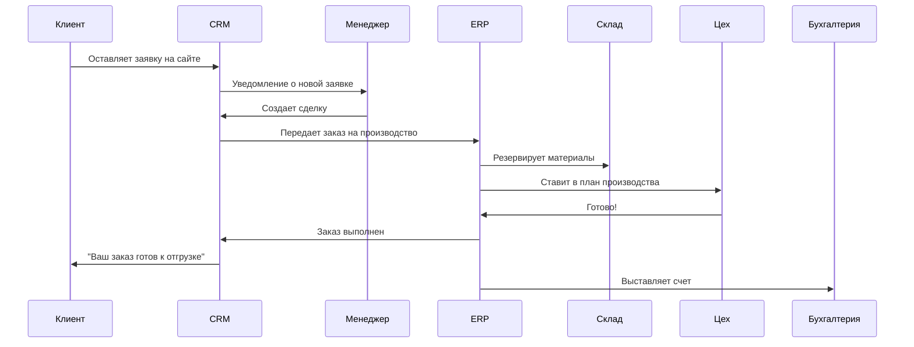

# **CRM и ERP: Просто о сложном**

## **📊 CRM (Customer Relationship Management)**
### **Что это?**
**Система управления взаимоотношениями с клиентами.**

### **Простая аналогия:**
```
CRM = Электронная записная книжка + Напоминалка + Досье на клиента
```

### **Что делает CRM:**
```yaml
Клиенты:
  - Хранит все контакты клиентов
  - Записывает историю общения
  - Напоминает о звонках/встречах

Продажи:
  - Ведет воронку продаж
  - Контролирует сделки
  - Считает конверсию

Маркетинг:
  - Отправляет рассылки
  - Собирает заявки с сайта
  - Анализирует кампании

Обслуживание:
  - Учет обращений в поддержку
  - База знаний
  - Чат с клиентами
```

### **Пример в жизни:**
```
Магазин одежды:
├── Дима купил футболку → в CRM запись
├── Через месяц: "Дима, у нас новые джинсы!" (рассылка)
├── Дима звонит: "Есть размер 50?" → оператор видит всю историю
└→ Дима доволен, покупает еще
```

### **Популярные CRM:**
```
Для малого бизнеса:
├── Битрикс24 (Россия)
├── amoCRM (Россия)
├── RetailCRM (розница)
└── Мегаплан

Для среднего/крупного:
├── Salesforce (мировой лидер)
├── Microsoft Dynamics 365
├── HubSpot
└── Zoho CRM
```

---

## **🏭 ERP (Enterprise Resource Planning)**
### **Что это?**
**Система управления ресурсами предприятия.**

### **Простая аналогия:**
```
ERP = Мозг компании, который все видит и всем управляет
```

### **Что делает ERP:**
```yaml
Финансы:
  - Бухгалтерия
  - Отчеты
  - Платежи
  - Бюджетирование

Производство:
  - Планирование производства
  - Учет материалов
  - Контроль качества
  - Логистика

Склад:
  - Учет товаров
  - Заказы поставщикам
  - Инвентаризация

Персонал:
  - Зарплата
  - Графики работы
  - Отпуска и больничные
```

### **Пример в жизни:**
```
Производство стульев:
├── Менеджер принимает заказ на 1000 стульев
├→ ERP автоматически:
│  ├── Заказывает дерево у поставщика
│  ├── Ставит в план цеху
│  ├── Резервирует место на складе
│  ├── Считает себестоимость
│  └── Начисляет зарплату рабочим
└→ Через 2 недели стулья готовы, клиент платит
```

### **Популярные ERP:**
```
Российские:
├── 1С:Предприятие (лидер в РФ)
├── Галактика
├── Парус
└── SAP Business One

Международные:
├── SAP (мировой гигант)
├── Oracle ERP Cloud
├── Microsoft Dynamics 365
└── Odoo (open source)
```

---

## **🔍 Ключевые отличия**

### **Таблица сравнения:**
| Параметр | CRM | ERP |
|----------|-----|-----|
| **Основная цель** | Увеличение продаж | Оптимизация процессов |
| **Кто использует** | Отдел продаж, маркетинг | Весь бизнес |
| **Данные** | Клиенты, сделки | Финансы, товары, производство |
| **Пример задачи** | "Как увеличить конверсию?" | "Как снизить себестоимость?" |
| **Цена** | 1 000 - 50 000 ₽/мес | 50 000 - 1 000 000+ ₽/мес |
| **Внедрение** | 1 - 3 месяца | 6 - 18 месяцев |

### **Визуализация:**
```
CRM (КЛИЕНТЫ)           ERP (ВНУТРИ КОМПАНИИ)
      ↓                           ↓
Кто купит? → Сколько нужно сделать? → Из чего сделать? → Сколько стоит?
      ↓                           ↓
   Продажи                    Производство
      ↓                           ↓
   Деньги                      Ресурсы
```

---

## **🎯 Что выбрать для бизнеса?**

### **Малый бизнес (до 10 сотрудников):**
```yaml
Нужно: CRM
Почему: 
  - Главная задача - находить клиентов
  - Цена от 1000 ₽/мес
  - Внедрение за 1-2 недели
Пример: Магазин, салон красоты, freelancer
```

### **Средний бизнес (10-100 сотрудников):**
```yaml
Нужно: CRM + ERP (легкий)
Почему:
  - Нужно и продавать, и оптимизировать процессы
  - Можно начать с CRM, потом добавить ERP
Пример: Производство мебели, сеть кафе, ИТ-компания
```

### **Крупный бизнес (100+ сотрудников):**
```yaml
Нужно: ERP + CRM (интегрированные)
Почему:
  - Масштаб требует автоматизации всего
  - Интеграция всех отделов
  - Сложные аналитика и отчетность
Пример: Завод, сеть гипермаркетов, банк
```

---

## **🔄 Как они работают вместе?**

### **Сценарий "От заявки до отгрузки":**


### **Интеграция данных:**
```
CRM данные → ERP:
├── Заказы клиентов
├── История покупок
└→ ERP использует для: планирования, закупок, финансов

ERP данные → CRM:
├── Наличие товара
├── Статус производства
└→ CRM использует для: точных обещаний клиентам
```

---

## **💰 Сколько стоит?**

### **CRM (месячная подписка):**
```
Базовый (1-5 пользователей):
├── Битрикс24: от 1 500 ₽
├── amoCRM: от 1 900 ₽
├── Мегаплан: от 1 290 ₽
└── RetailCRM: от 2 990 ₽

Профессиональный:
├── Salesforce: от 3 000 ₽/пользователь
├── Microsoft Dynamics: от 7 000 ₽/пользователь
└── HubSpot: бесплатно (ограничено)
```

### **ERP (разовые + ежемесячные):**
```
Российские:
├── 1С: 50 000 - 500 000 ₽ (лицензия) + 10 000 ₽/мес (поддержка)
├── Галактика: от 500 000 ₽
└── Парус: от 300 000 ₽

Международные:
├── SAP: от 2 000 000 ₽
├── Oracle: от 1 500 000 ₽
└── Odoo: бесплатно (Community) или от 10 000 ₽/мес (Enterprise)
```

### **Скрытые затраты:**
```yaml
Внедрение:
  - Настройка: 50-200% от стоимости лицензии
  - Обучение: 20-50 тыс. ₽/пользователь
  - Адаптация процессов: время сотрудников

Поддержка:
  - Абонентское обслуживание: 15-30% от лицензии/год
  - Доработки: от 1 500 ₽/час
  - Обновления: может ломать кастомизации
```

---

## **✅ Как выбрать?**

### **Чек-лист для CRM:**
```markdown
Да/Нет?
- [ ] Нужно хранить контакты клиентов?
- [ ] Много повторных продаж?
- [ ] Есть отдел продаж?
- [ ] Делаете email-рассылки?
- [ ] Хотите видеть воронку продаж?

Если 3+ "Да" → нужна CRM
```

### **Чек-лист для ERP:**
```markdown
Да/Нет?
- [ ] Есть производство или склад?
- [ ] Больше 20 сотрудников?
- [ ] Проблемы с учетом товаров/материалов?
- [ ] Задержки в производстве?
- [ ] Сложно сводить отчеты из разных отделов?

Если 3+ "Да" → нужна ERP
```

### **Вопросы поставщику:**
```markdown
1. Есть ли внедрение в моей сфере? (примеры)
2. Сколько стоит полный цикл (лицензия + внедрение + обучение)?
3. Есть ли мобильное приложение?
4. Русская техподдержка?
5. Можно ли протестировать бесплатно?
6. Как часто выходят обновления?
7. Есть интеграция с (ваши системы)?
```

---

## **🚀 Тренды 2024**

### **CRM:**
```
AI-помощники:
├── Автонаписание писем
├── Прогноз вероятности сделки
├── Рекомендации по работе с клиентом

Автоматизация:
├── Чат-боты 24/7
├── Роботы-звонки
├── Сквозная аналитика
```

### **ERP:**
```
Облачные решения:
├── SaaS-модель (подписка вместо покупки)
├── Доступ из любой точки
├── Автообновления

Интеграция с IoT:
├── Датчики на оборудовании → данные в ERP
├── Предиктивная аналитика поломок
├── Умные склады
```

---

## **🎯 Выводы**

### **CRM если:**
- Ваш бизнес зависит от клиентов
- Хотите увеличить продажи
- Теряете заказы из-за плохого учета
- Хотите автоматизировать маркетинг

### **ERP если:**
- Есть производство или логистика
- Большой штат сотрудников
- Проблемы с управлением ресурсами
- Нужна единая система учета

### **Идеально:**
**CRM + ERP + интеграция между ними**

```
Правильный путь:
1. Начать с CRM (рост продаж)
2. При росте → внедрить ERP (оптимизация)
3. Интегрировать их (идеальная автоматизация)
```

**Помните:** Система должна решать проблемы, а не создавать новые. Начинайте с малого, тестируйте, масштабируйте!
