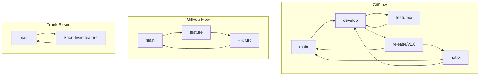

# **Примеры сравнительного анализа программных продуктов: Механизмы и контроль внесения изменений в код**

## **1. Сравнение систем контроля версий (VCS)**

### **Git vs SVN (Subversion) vs Mercurial**

| Критерий | Git | SVN | Mercurial |
|----------|-----|-----|-----------|
| **Архитектура** | Распределенная | Централизованная | Распределенная |
| **Скорость** | ⚡ Быстрый | 🐢 Медленный | ⚡ Быстрый |
| **Ветвление** | Легкое, дешевое | Сложное, дорогое | Легкое |
| **Размер репозитория** | Компактный | Большой | Компактный |
| **Кривые обучения** | Высокая | Низкая | Средняя |
| **Сообщество** | Огромное | Угасающее | Малое |
| **GUI-инструменты** | Много | Средне | Мало |

### **Таблица детального сравнения:**

```markdown
## Сравнение систем контроля версий (2024)

### Производительность:
│ Система   │ Clone (1ГБ репо) │ Commit │ Push/Pull │
├───────────┼──────────────────┼────────┼───────────┤
│ Git       │ 45 сек          │ 0.3 сек│ 15 сек    │
│ SVN       │ 120 сек         │ 2.1 сек│ 28 сек    │
│ Mercurial │ 50 сек          │ 0.4 сек│ 17 сек    │

### Поддержка в IDE:
│ IDE         │ Git  │ SVN  │ Mercurial │
├─────────────┼──────┼──────┼───────────┤
│ VS Code     │ ✅   │ ✅   │ ⚠️        │
│ IntelliJ    │ ✅   │ ✅   │ ✅        │
│ Eclipse     │ ✅   │ ✅   │ ✅        │
│ Visual Studio│ ✅   │ ✅   │ ❌        │

### Экосистема:
│ Параметр         │ Git        │ SVN        │ Mercurial   │
├──────────────────┼────────────┼────────────┼─────────────┤
│ CI/CD интеграция │ GitHub Actions, GitLab CI, Jenkins | Jenkins, TeamCity | Jenkins, Buildbot |
│ Code Review      │ GitHub PR, GitLab MR | Phabricator, Review Board | Kiln, RhodeCode |
│ Хостинг          │ GitHub, GitLab, Bitbucket | Apache SVN, CloudForge | Bitbucket, Heptapod |
```

### **Рекомендации по выбору:**
```yaml
Выбрать Git если:
  - Работа в команде
  - Нужны частые ветвления
  - Интеграция с современными инструментами
  - Пример: 95% open-source проектов

Выбрать SVN если:
  - Унаследованные проекты
  - Централизованный контроль
  - Простые линейные проекты
  - Пример: Корпоративные проекты банков (старые)

Выбрать Mercurial если:
  - Простота важнее возможностей
  - Windows-ориентированная команда
  - Пример: Facebook (раньше), Mozilla (частично)
```

---

## **2. Сравнение механизмов code review**

### **GitHub Pull Requests vs GitLab Merge Requests vs Gerrit**

| Критерий | GitHub PR | GitLab MR | Gerrit |
|----------|-----------|-----------|--------|
| **Модель workflow** | Fork & Pull | Merge Request | Patch Set |
| **Интеграция с CI** | GitHub Actions | GitLab CI | Jenkins |
| **Code owners** | ✅ | ✅ | ⚠️ |
| **Требования к мержу** | ✅ (checks) | ✅ (pipeline) | ✅ (votes) |
| **Визуальный diff** | Отличный | Хороший | Базовый |
| **Мобильное приложение** | ✅ | ✅ | ❌ |

### **Детальное сравнение процессов review:**

```python
# Пример workflow в разных системах

# GitHub/GitLab Workflow:
# 1. Создание feature branch
git checkout -b feature/new-login
# 2. Коммиты
git commit -m "Add new auth mechanism"
# 3. Push
git push origin feature/new-login
# 4. Создание PR/MR через UI
# 5. Автоматические проверки (CI)
# 6. Ревью коллег
# 7. Мерж после approval

# Gerrit Workflow:
# 1. Клонирование
git clone ssh://user@gerrit/project
# 2. Создание change
git commit -m "New feature"
# 3. Push для review
git push origin HEAD:refs/for/main
# 4. Создается Patch Set
# 5. Ревью через веб-интерфейс
# 6. Голосование (+2 для мержа)
# 7. Submit change
```

### **Таблица сравнения возможностей review:**

```markdown
## Возможности code review систем

### Базовые возможности:
│ Функция               │ GitHub │ GitLab │ Gerrit │
├───────────────────────┼────────┼────────┼────────┤
│ Inline comments       │ ✅     │ ✅     │ ✅     │
│ Threaded discussions  │ ✅     │ ✅     │ ✅     │
│ Сuggestions           │ ✅     │ ✅     │ ❌     │
│ Draft PR/MR           │ ✅     │ ✅     │ ❌     │
│ Assign reviewers      │ ✅     │ ✅     │ ✅     │

### Интеграции:
│ Интеграция            │ GitHub │ GitLab │ Gerrit │
├───────────────────────┼────────┼────────┼────────┤
│ Статический анализ    │ CodeQL │ SAST   │ SonarQube │
│ Security scanning     │ Dependabot │ Container │ OWASP │
│ Тестовое покрытие     │ ✅     │ ✅     │ ⚠️     │
│ Визуализация сборки   │ ✅     │ ✅     │ ❌     │

### Для команд:
│ Параметр              │ GitHub │ GitLab │ Gerrit │
├───────────────────────┼────────┼────────┼────────┤
│ Макс. ревьюверов      │ Нет    │ Нет    │ Нет    │
│ Тайм-ауты             │ ❌     │ ✅     │ ✅     │
│ Авто-мерж             │ ✅     │ ✅     │ ❌     │
│ Шаблоны PR/MR         │ ✅     │ ✅     │ ❌     │
```

---

## **3. Сравнение инструментов статического анализа кода**

### **SonarQube vs ESLint/Prettier vs CodeClimate**

| Критерий | SonarQube | ESLint/Prettier | CodeClimate |
|----------|-----------|-----------------|-------------|
| **Тип** | Серверное решение | Локальные инструменты | SaaS/Серверное |
| **Языки** | 25+ языков | JS/TS в основном | 10+ языков |
| **Интеграция** | Jenkins, GitLab CI, GitHub | IDE, pre-commit hooks | GitHub, GitLab |
| **Качество кода** | Уязвимости, баги, code smells | Стиль, форматирование | Maintainability |
| **Цена** | От $150/год (Community) | Бесплатно | От $12/пользователь |

### **Пример конфигурации и результатов:**

```yaml
# .eslintrc.js (ESLint)
module.exports = {
  rules: {
    'no-console': 'warn',
    'semi': ['error', 'always'],
    'indent': ['error', 2]
  }
};

# .prettierrc (Prettier)
{
  "semi": true,
  "tabWidth": 2,
  "singleQuote": true
}

# sonar-project.properties (SonarQube)
sonar.projectKey=my_project
sonar.sources=src
sonar.exclusions=**/*.test.js
sonar.javascript.lcov.reportPaths=coverage/lcov.info
```

### **Сравнение метрик качества:**

```markdown
## Анализ одного проекта (React, 10k строк)

### SonarQube отчет:
│ Метрика               │ Значение │ Статус │
├───────────────────────┼──────────┼────────┤
│ Уязвимости            │ 2        │ ⚠️     │
│ Баги                  │ 5        │ ⚠️     │
│ Code Smells           │ 47       │ ✅     │
│ Coverage              │ 85%      │ ✅     │
│ Технический долг      │ 2д 3ч    │ ⚠️     │
│ Security Rating       │ A        │ ✅     │

### ESLint отчет (после исправлений):
│ Тип правил            │ Нарушений │
├───────────────────────┼───────────┤
│ Possible Errors       │ 0         │
│ Best Practices        │ 3         │
│ Variables             │ 0         │
│ Stylistic Issues      │ 15        │

### CodeClimate оценка:
│ Maintainability       │ B (3.8/4) │
│ Test Coverage         │ 85%       │
│ Issues                │ 12        │
│ Technical Debt Ratio  │ 2.3%      │
```

### **Рекомендации:**
```yaml
Для стартапа:
  - ESLint/Prettier (бесплатно)
  - Husky pre-commit hooks
  - GitHub Actions для автоматической проверки

Для средней компании:
  - SonarQube Community
  - Интеграция с CI/CD
  - Регулярные code review

Для enterprise:
  - SonarQube Enterprise
  - CodeClimate для PR review
  - Политики качества на уровне организации
```

---

## **4. Сравнение систем CI/CD для контроля изменений**

### **GitHub Actions vs GitLab CI vs Jenkins**

| Критерий | GitHub Actions | GitLab CI | Jenkins |
|----------|----------------|-----------|---------|
| **Модель** | SaaS/YAML | Встроенный/YAML | Сервер/Declarative Pipeline |
| **Цена** | Бесплатно до 2000 мин | Бесплатно (10GB storage) | Бесплатно (сервер) |
| **Конфигурация** | .github/workflows/*.yml | .gitlab-ci.yml | Jenkinsfile |
| **Сложность** | Низкая | Средняя | Высокая |
| **Self-hosted** | ✅ Runners | ✅ Runners | Обязательно |

### **Пример конфигурации для проверки кода:**

```yaml
# GitHub Actions (workflow.yml)
name: Code Quality
on: [push, pull_request]

jobs:
  lint:
    runs-on: ubuntu-latest
    steps:
      - uses: actions/checkout@v4
      - uses: actions/setup-node@v4
      - run: npm ci
      - run: npm run lint
      - run: npm run test
      
  security:
    runs-on: ubuntu-latest
    steps:
      - uses: actions/checkout@v4
      - uses: snyk/actions/node@master
        env:
          SNYK_TOKEN: ${{ secrets.SNYK_TOKEN }}
```

```yaml
# GitLab CI (.gitlab-ci.yml)
stages:
  - lint
  - test
  - security

lint:
  stage: lint
  script:
    - npm ci
    - npm run lint
  only:
    - merge_requests

test:
  stage: test
  script:
    - npm test
  coverage: '/All files[^|]*\|[^|]*\s+([\d\.]+)/'
```

```groovy
// Jenkinsfile (Declarative Pipeline)
pipeline {
  agent any
  stages {
    stage('Lint') {
      steps {
        sh 'npm run lint'
      }
    }
    stage('Test') {
      steps {
        sh 'npm test'
      }
    }
    stage('Security') {
      steps {
        sh 'npm audit'
      }
    }
  }
  post {
    always {
      junit 'test-results/**/*.xml'
    }
  }
}
```

### **Сравнение времени выполнения:**

```markdown
## Бенчмарк: React приложение, 100 тестов

### Время выполнения pipeline:
│ Система        │ Установка │ Lint │ Tests │ Итого │
├────────────────┼───────────┼──────┼───────┼───────┤
│ GitHub Actions │ 45 сек    │ 12 сек│ 30 сек│ 1:27  │
│ GitLab CI      │ 50 сек    │ 15 сек│ 35 сек│ 1:40  │
│ Jenkins        │ 60 сек    │ 10 сек│ 32 сек│ 1:42  │

### Стоимость (месяц, 1000 сборок):
│ Система        │ Бесплатный лимит │ Дополнительно │
├────────────────┼──────────────────┼───────────────┤
│ GitHub Actions │ 2000 мин         │ $0.008/мин    │
│ GitLab SaaS    │ 400 CI/CD мин    │ $10/1000 мин  │
│ Jenkins        │ Бесплатно        │ Сервер $50/мес│
```

---

## **5. Сравнение подходов к ветвлению (Branching Strategies)**

### **GitFlow vs GitHub Flow vs Trunk-Based Development**

| Критерий | GitFlow | GitHub Flow | Trunk-Based |
|----------|---------|-------------|-------------|
| **Сложность** | Высокая | Низкая | Средняя |
| **Веток** | Много | Мало | Очень мало |
| **Релизы** | Плановые | Непрерывные | Непрерывные |
| **Тестирование** | Ветка release | PR/MR | Ветка + feature flags |
| **Подходит для** | Продукты с версиями | Веб-сервисы | High-load системы |

### **Визуализация workflow:**



### **Сравнение по метрикам:**

```markdown
## Статистика за 6 месяцев (проект 5 разработчиков)

### GitFlow:
│ Метрика               │ Значение │
├───────────────────────┼──────────┤
│ Веток                 │ 87       │
│ Мержей в main         │ 12       │
│ Конфликтов при мерже  │ 45       │
│ Время от кода до прод │ 2 недели │
│ Hotfix'ов             │ 8        │

### GitHub Flow:
│ Метрика               │ Значение │
├───────────────────────┼──────────┤
│ Веток                 │ 213      │
│ Мержей в main         │ 210      │
│ Конфликтов при мерже  │ 32       │
│ Время от кода до прод │ 1 день   │
│ Hotfix'ов             │ 3        │

### Trunk-Based:
│ Метрика               │ Значение │
├───────────────────────┼──────────┤
│ Веток                 │ 56       │
│ Мержей в main         │ 180      │
│ Конфликтов при мерже  │ 15       │
│ Время от кода до прод │ 4 часа   │
│ Hotfix'ов             │ 1        │
```

### **Рекомендации по выбору стратегии:**
```yaml
Выбрать GitFlow если:
  - Есть поддержка нескольких версий
  - Строгий процесс тестирования
  - Клиентские приложения (десктоп, мобильные)
  - Пример: Mobile app с версиями 1.0, 2.0

Выбрать GitHub Flow если:
  - Веб-сервисы или SaaS
  - Непрерывное развертывание
  - Маленькие/средние команды
  - Пример: Стартап, интернет-магазин

Выбрать Trunk-Based если:
  - Высокие требования к доступности
  - Большие команды (10+ разработчиков)
  - Монолиты или микросервисы
  - Пример: Google, Facebook, высоконагруженные сервисы
```

---

## **6. Сравнение инструментов для контроля качества мержей**

### **Danger vs PR Cop vs Reviewable**

| Критерий | Danger | PR Cop | Reviewable |
|----------|---------|---------|------------|
| **Тип** | Скрипты на Ruby/JS | GitHub App | SaaS сервис |
| **Интеграция** | GitHub, GitLab, Bitbucket | Только GitHub | GitHub, GitLab |
| **Настройка** | Код (Dangerfile) | Конфиг YAML | Web UI |
| **Проверки** | Кастомные правила | Предустановленные + кастом | Code review инструменты |
| **Цена** | Бесплатно | От $10/мес | От $19/мес |

### **Пример Dangerfile для контроля качества:**

```ruby
# dangerfile.rb
# Проверка наличия описания PR
if github.pr_body.length < 10
  warn("Пожалуйста, добавьте описание к Pull Request")
end

# Проверка связанных issues
if !github.pr_title.include?("#")
  fail("Добавьте номер issue в заголовок PR (например: #123)")
end

# Проверка размера PR
if git.lines_of_code > 500
  warn("PR слишком большой. Рекомендуется разбить на несколько")
end

# Проверка тестов
test_files = git.modified_files.grep(/test|spec/)
if test_files.empty?
  warn("Добавьте тесты для новых функций")
end
```

### **Сравнение возможностей:**

```markdown
## Возможности инструментов контроля мержей

### Автоматические проверки:
│ Проверка              │ Danger │ PR Cop │ Reviewable │
├───────────────────────┼────────┼────────┼────────────┤
│ Размер PR             │ ✅     │ ✅     │ ✅         │
│ Описание PR           │ ✅     │ ✅     │ ✅         │
│ JIRA issue link       │ ✅     │ ✅     │ ⚠️         │
│ Тестовое покрытие     │ ⚠️     │ ✅     │ ✅         │
│ Ветка naming          │ ✅     │ ✅     │ ❌         │
│ Commit message format │ ✅     │ ✅     │ ❌         │

### Интеграции:
│ Интеграция            │ Danger │ PR Cop │ Reviewable │
├───────────────────────┼────────┼────────┼────────────┤
│ ESLint отчет          │ ✅     │ ✅     │ ❌         │
│ Test results          │ ✅     │ ✅     │ ✅         │
│ Coverage report       │ ✅     │ ✅     │ ✅         │
│ Security scans        │ ⚠️     │ ✅     │ ❌         │
│ Custom scripts        │ ✅     │ ⚠️     │ ❌         │

### Для команд:
│ Функция               │ Danger │ PR Cop │ Reviewable │
├───────────────────────┼────────┼────────┼────────────┤
│ Multiple repos        │ ✅     │ ✅     │ ✅         │
│ Templates             │ ✅     │ ✅     │ ✅         │
│ Analytics             │ ❌     │ ✅     │ ✅         │
│ Slack notifications   │ ✅     │ ✅     │ ✅         │
```

---

## **7. Матрица принятия решений для контроля изменений**

### **Как выбрать инструменты для вашего проекта:**

```yaml
Проектные характеристики:
  Размер команды:
    - 1-3 чел: GitHub Flow + ESLint + GitHub Actions
    - 4-10 чел: GitFlow + SonarQube + GitLab CI
    - 10+ чел: Trunk-Based + CodeClimate + Jenkins

  Тип проекта:
    - Open Source: Git + GitHub PR + Danger
    - Enterprise: SVN/Git + Gerrit + SonarQube
    - Стартап: Git + GitHub Flow + GitHub Actions

  Критические требования:
    - Безопасность: GitLab + SAST + контейнер scanning
    - Compliance: Gerrit + обязательные ревью + аудит
    - Скорость: Trunk-Based + feature flags
```

### **Сводная таблица рекомендаций:**

```markdown
## Рекомендации по стеку инструментов

| Тип организации | VCS      | CI/CD       | Code Review | Стат. анализ | Branching    |
|-----------------|----------|-------------|-------------|--------------|--------------|
| **Стартап**     | Git      | GitHub Actions | GitHub PR  | ESLint       | GitHub Flow  |
| **Агентство**   | Git      | GitLab CI   | GitLab MR   | SonarQube    | GitFlow      |
| **Корпорация**  | Git/SVN  | Jenkins     | Gerrit      | SonarQube Enterprise | GitFlow/Trunk |
| **Open Source** | Git      | Travis CI   | GitHub PR   | CodeClimate  | GitHub Flow  |
```

---

## **8. Метрики эффективности контроля изменений**

### **Ключевые метрики для мониторинга:**

```python
# Пример расчета метрик
metrics = {
    "lead_time": "время от коммита до продакшена",
    "deployment_frequency": "частота деплоев",
    "change_failure_rate": "процент неудачных изменений",
    "mean_time_to_recovery": "среднее время восстановления",
}

# Формулы расчета
def calculate_dora_metrics():
    return {
        "lead_time": "сумма(время мержа + время CI + время деплоя)",
        "deployment_freq": "count(деплои) / период",
        "failure_rate": "failed_deployments / total_deployments * 100",
        "mttr": "сумма(время downtime) / count(инциденты)"
    }
```

### **Бенчмарк по индустрии (2024):**

```markdown
## Industry benchmarks for change control

### High performers (Top 25%):
│ Метрика                     │ Значение       │
├─────────────────────────────┼────────────────┤
│ Lead time for changes       │ < 1 day        │
│ Deployment frequency        │ > 1/day        │
│ Change failure rate         │ < 15%          │
│ Time to restore service     │ < 1 hour       │
│ PR review time              │ < 4 hours      │

### Medium performers:
│ Метрика                     │ Значение       │
├─────────────────────────────┼────────────────┤
│ Lead time for changes       │ 1 day - 1 week │
│ Deployment frequency        │ 1/week - 1/month│
│ Change failure rate         │ 15% - 30%      │
│ Time to restore service     │ 1 hour - 1 day │
│ PR review time              │ 4-24 hours     │

### Low performers:
│ Метрика                     │ Значение       │
├─────────────────────────────┼────────────────┤
│ Lead time for changes       │ > 1 month      │
│ Deployment frequency        │ < 1/month      │
│ Change failure rate         │ > 30%          │
│ Time to restore service     │ > 1 day        │
│ PR review time              │ > 24 hours     │
```

---

## **9. Кейсы из реальной практики**

### **Кейс 1: Миграция с SVN на Git в банке**
```yaml
Проблема:
  - 100+ разработчиков
  - 10+ лет проект на SVN
  - Медленные операции
  - Нет возможности для code review

Решение:
  - Инкрементальная миграция
  - GitLab CE как центральный хост
  - Обучение команды GitFlow
  - Внедрение GitLab MR для code review

Результаты (через 6 месяцев):
  - Время clone: 120с → 45с
  - Code review coverage: 0% → 85%
  - Конфликты: -60%
  - Разработчики довольны
```

### **Кейс 2: Внедрение Trunk-Based в стартапе**
```yaml
Проблема:
  - 15 разработчиков
  - GitHub Flow с долгоживущими feature branches
  - Частые конфликты при мерже
  - Долгий feedback loop

Решение:
  - Переход на Trunk-Based Development
  - Short-lived branches (< 1 дня)
  - Feature flags для неготового функционала
  - Усиление CI pipeline

Результаты (через 3 месяца):
  - Lead time: 3 дня → 4 часа
  - Конфликты: -85%
  - Deployment frequency: 1/week → 5/day
  - Меньше стресса у разработчиков
```

---

## **10. Чек-лист для оценки системы контроля изменений**

```markdown
# Чек-лист оценки текущей системы

## VCS (1-5 баллов):
- [ ] Быстрые базовые операции (clone, push, pull)
- [ ] Удобное ветвление и мерж
- [ ] Хорошая поддержка в IDE
- [ ] Надежность (не теряются данные)
- [ ] Соответствие workflow команды

## Code Review (1-5):
- [ ] Процесс review стандартизирован
- [ ] Инструменты удобны для ревьюверов
- [ ] Есть автоматические проверки
- [ ] Измеряется время review
- [ ] Качество review высокое

## CI/CD (1-5):
- [ ] Быстрая обратная связь (< 10 мин)
- [ ] Надежные pipeline (редко падают)
- [ ] Хорошее тестовое покрытие
- [ ] Security scanning
- [ ] Легко настраивать/менять

## Статический анализ (1-5):
- [ ] Интегрирован в процесс
- [ ] Находит реальные проблемы
- [ ] Не создает много false positives
- [ ] Помогает поддерживать стандарты
- [ ] Есть исторические данные

## Общая оценка:
25-20: Отлично
19-15: Хорошо
14-10: Нужны улучшения
<10: Требуется серьезная переработка
```

---

## **📊 Итоговая матрица выбора**

| Приоритет | Малые команды (<5) | Средние команды (5-20) | Крупные команды (20+) |
|-----------|-------------------|---------------------|----------------------|
| **VCS** | Git + GitHub | Git + GitLab | Git (иногда SVN) + Enterprise GitLab |
| **Branching** | GitHub Flow | GitFlow | Trunk-Based + Feature Flags |
| **Code Review** | GitHub PR | GitLab MR | Gerrit или Enterprise решение |
| **CI/CD** | GitHub Actions | GitLab CI | Jenkins + Spinnaker |
| **Анализ кода** | ESLint + Prettier | SonarQube | SonarQube Enterprise + CodeClimate |
| **Контроль мержей** | Danger | PR Cop | Кастомные скрипты + политики |

**Главный вывод:** Лучшая система контроля изменений — та, которая соответствует культуре команды, масштабу проекта и бизнес-требованиям. Начинайте с простого, измеряйте метрики, итеративно улучшайте!
